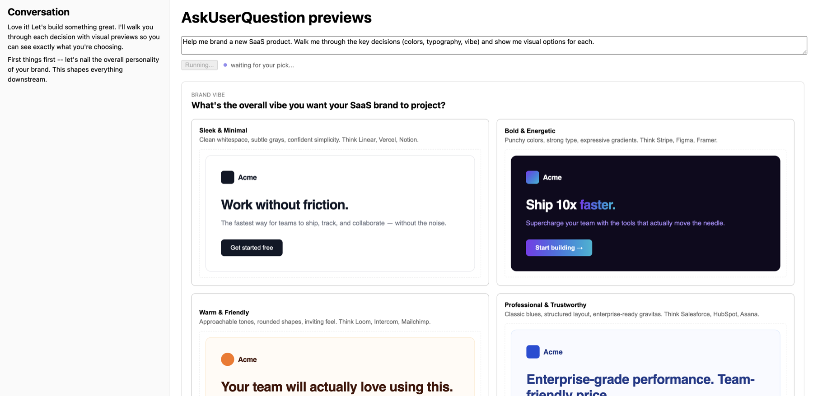

# AskUserQuestion HTML 预览

演示 [`AskUserQuestion` 工具](https://platform.claude.com/docs/en/agent-sdk/user-input#option-previews-type-script) 的 HTML 预览功能。

通常，当 Claude 提出澄清性问题时，用户从文本标签中进行选择。使用预览后，每个选项都包含一个渲染好的 HTML 片段，让用户在做出选择之前就能看到效果。

本示例运行一个品牌助手。让它帮你为新品牌做设计，Claude 会一项一项地引导你做决策（配色方案、字体排印、风格调性），并将每个选项渲染为实时的 HTML 模型：示例界面、色板、字体样张。点击卡片进行选择，如果没有合适的也可以自己输入答案。



这是一个一次性（one-shot）示例：输入一条提示，Claude 提出它的澄清性问题，然后给出最终方案并结束。Claude 会在有帮助的选项上附带 HTML 预览（如配色方案、布局选择），在无帮助的则省略（如是非题、纯文本选择）。客户端对两种情况都做了渲染：带预览框的卡片，或仅标签+描述。

**技术栈：** 服务端是一个 Node.js HTTP 服务器，使用 `ws` 库进行 WebSocket 通信，使用 `tsx` 执行 TypeScript。客户端是一个用 Vite 构建的 React 18 应用，使用 DOMPurify 对预览 HTML 进行净化，使用 react-markdown 渲染 Claude 的文本输出。

## 前置条件

- **Node.js 18+**
- **认证**方式任选其一：
  - 一个 Anthropic API 密钥（[在此获取](https://console.anthropic.com/settings/keys)），或
  - 一个已存在的 `claude login` 会话（SDK 运行 Claude CLI，因此其存储的 OAuth 凭据同样有效）

## 安装

首先，安装依赖：

```bash
npm install
```

接下来，配置认证。**如果你已经运行过 `claude login`，请跳过此步骤**，因为 CLI 存储的凭据会被自动读取。

否则，根据模板创建 `.env` 文件。

```bash
cp .env.example .env
```

然后打开 `.env`，将占位符替换为你的密钥。

最后，启动开发服务器：

```bash
npm run dev
```

## 试用示例应用

打开 http://localhost:5173。提示输入框已预填了一个品牌助手场景。点击 **Run** 开始。

Claude 会提出一系列澄清性问题，每个问题都带有一组展示渲染后 HTML 模型（色板、字体样张、示例界面）的预览卡片。点击卡片选择该选项，或在卡片下方的输入框中输入自由文本答案。

由于每个预览都是完整的 HTML 片段，生成它们可能需要一点时间；状态栏会显示进度。

## 文件

- [**`server.ts`**](server.ts)：Node 服务器。调用 `query()`，将 SDK 流事件映射为状态更新，并通过 `canUseTool` 将 `AskUserQuestion` 转发到浏览器。
- [**`client/App.tsx`**](client/App.tsx)：React 界面。渲染当前问题的预览卡片和对话日志。预览渲染逻辑见 `QuestionView`。
- [**`client/useAgentSocket.ts`**](client/useAgentSocket.ts)：WebSocket 连接、自动重连和消息分发。

## 工作原理

大部分代码处理的是 WebSocket 传输、状态指示、Markdown 渲染和布局。与预览功能相关的代码量很小且局部化：

| 位置 | 内容 |
|-------|------|
| [`server.ts` 配置块](server.ts#L90-L97) | `toolConfig.askUserQuestion.previewFormat: "html"` 启用预览；`permissionMode: "plan"` 和 `tools: ["AskUserQuestion"]` 让 Claude 真正使用该工具 |
| [`server.ts` 的 `canUseTool`](server.ts#L98-L132) | 拦截 `AskUserQuestion`，将其转发到浏览器，等待选择，返回 `{ behavior: "allow", updatedInput: { questions, answers } }` |
| [`client/App.tsx` 的 `QuestionView`](client/App.tsx#L97-L192) | 使用 `dangerouslySetInnerHTML` + DOMPurify 渲染 `opt.preview` |

### SDK 配置

服务端设置了一个自定义 [`systemPrompt`](server.ts#L73-L89)，完全替换了默认的 Claude Code 指令，将 Claude 变成了一个品牌助手。（如果想保留默认指令并附加内容，请改用带 `append` 的 `systemPrompt`。）它还传入了三个[影响工具行为的选项](server.ts#L90-L97)：

```ts
permissionMode: "plan",                                   // 引导 Claude 在行动前先提问
tools: ["AskUserQuestion"],                               // 只提供这一个工具
toolConfig: { askUserQuestion: { previewFormat: "html" } } // 为每个选项添加 opt.preview
```

`previewFormat: "html"` 是本示例演示的特性。没有它，选项只有 `label` 和 `description`。有了它，Claude 会为每个选项的 `preview` 字段生成一个带样式的 `<div>` 片段（SDK 会在你的回调看到之前，先剥离 `<script>` 和 `<style>` 标签）。

另外两个选项让 Claude 真正去使用这个工具。`permissionMode: "plan"` 将 Claude 置于需求收集的心智模式中，它会自然地提出澄清性问题。`tools: ["AskUserQuestion"]` 将可用工具集限制为这一个工具，于是 Claude 别无选择，只能提问，而无法执行写文件或运行命令之类的动作。

### 服务端到浏览器的往返

SDK 将 Claude CLI 作为子进程 spawn，因此 `query()` 及其 `canUseTool` 回调运行在服务端。本示例通过 WebSocket 将它们与浏览器连接起来：

1. 浏览器通过 WebSocket 发送提示
2. 服务端调用 [`query()`](server.ts#L69) 并开始流式传输
3. 当 Claude 调用 `AskUserQuestion` 时，[`canUseTool`](server.ts#L98) 触发，携带问题（包括每个 `opt.preview` 的 HTML）
4. 服务端将问题转发到浏览器，并将[promise 的 resolver](server.ts#L121) 存入一个 `Map`
5. 浏览器[将预览渲染为卡片](client/App.tsx#L97-L170)，通过 `dangerouslySetInnerHTML`（经 DOMPurify 净化）
6. 用户点击卡片（或输入自由文本答案）；浏览器将标签发回
7. 服务端[resolve 该 promise](server.ts#L44)，`canUseTool` 在 `updatedInput.answers` 中返回答案，SDK 继续

```
browser ──prompt──▶ server ──query()──▶ SDK
                              │
                    canUseTool fires with
                    questions[].options[].preview  ◀── HTML fragment
                              │
browser ◀─question── server (awaits...)
   │
  user clicks a card
   │
browser ──answer──▶ server ──resolves canUseTool──▶ SDK continues
```

服务端会记录每个流事件（`[stream] system/init`、`block: tool_use (AskUserQuestion)` 等），方便你在终端中观察流程。

## 扩展示例

本示例涵盖了一个从提示到方案的流程。以下是一些利用其他 SDK 特性进行扩展的思路。

**后续对话。** 切换到[流式输入](https://platform.claude.com/docs/en/agent-sdk/streaming-vs-single-mode)，让用户能在最终方案之后继续对话："把紫色调深一点"、"用衬线体再给我看一遍"。`canUseTool` 处理函数保持不变；你只需改变喂入提示的方式。

**更丰富的答案类型。** `AskUserQuestion` 每个问题最多 4 个选项，且标签是短字符串。对于滑块、取色器或多字段表单，定义一个[自定义工具](https://platform.claude.com/docs/en/agent-sdk/custom-tools)，其输入 schema 与你的 UI 收集的内容匹配。往返模式（服务端等待 promise、浏览器 resolve 它）完全相同。

**在 Claude 等待时通知。** 添加一个 [`PermissionRequest` 钩子](https://platform.claude.com/docs/en/agent-sdk/hooks#available-hooks)，每当 `canUseTool` 即将阻塞时，触发一条 Slack 消息、推送通知或邮件。如果品牌流程是异步运行且用户没在看标签页，这就很有用。

**多选。** `AskUserQuestion` 支持每个问题 `multiSelect: true`。本示例每次只回传一个标签；要支持多选，请将 `pick()` 改为累积标签并添加一个"完成"按钮，然后在答案值中用 `", "` 连接它们。

## 另请参阅

- [AskUserQuestion 文档](https://platform.claude.com/docs/en/agent-sdk/user-input#option-previews-type-script)
- [Plan 模式](https://platform.claude.com/docs/en/agent-sdk/permissions#plan-mode-plan)
