# Claude Agent SDK 实战案例

Learning the SDK Through 8 Official Demos

**创建者**: 标叔
**为谁创建**: 想用 Claude Agent SDK 做真实产品的开发者。要求会写 TypeScript 或 Python，最好被 AI 应用折腾过一次
**基于**: `@anthropic-ai/claude-agent-sdk` 与官方案例仓库 claude-agent-sdk-demos（8 个 demo、74 个源码文件）
**最后更新**: 2026-09-06
**适用场景**: 从第一次跑通 `query()`，到把 Agent 塞进桌面应用、Web 服务和批处理脚本

---

### 阅读指南

| 时间 | 章节 | 目标 |
|------|------|------|
| Day 1 | §01-§03 | 建立正确的心智模型，跑通第一个 Agent |
| Day 2-3 | §04-§06 | 掌握工具、自定义扩展、Hooks 三件武器 |
| Day 4-5 | §07-§08 | 搞定多轮会话与多 Agent 编排 |
| Day 6-7 | §09-§12 | 流式中断、宿主形态、生产化落地 |

### 全书结构

**Part 1 起步** —— §01 它不是 SDK，是一个会干活的进程 / §02 跑通第一个 query / §03 Agent 循环内幕

**Part 2 核心能力** —— §04 工具与权限四层闸 / §05 自定义工具怎么造 / §06 Hooks 拦截时机 / §07 多轮会话三种范式 / §08 多 Agent 编排

**Part 3 进阶实战** —— §09 流式与中断 / §10 三种宿主形态 / §11 生产化七道坎 / §12 从调模型到造环境

---

## Part 1: 起步

从零到一。读完这三章，你能跑通第一个真正干活的 Agent。

---

## §01 它不是 SDK，是一个会干活的进程


> 小黑值守在铁皮舱室里，两根管子一根塞活、一根吐结果——你启动的不是一次调用，是一个会干活的进程。


### 01.1 我把 8 个官方 demo 全读了一遍

我把官方案例仓库里的 8 个 demo 全读完了。70 个 TypeScript 文件，4 个 Python 文件。

读完最大的感受是：大部分人第一次接触 Claude Agent SDK，都会把它理解错。

它不是 SDK。至少不是你熟悉的那种 SDK。

你熟悉的 SDK 长这样：你调一个方法，它返回一个结果。你负责拼参数，它负责执行。

Claude Agent SDK 不长这样。你调 `query()`，它返回一个消息流。中间发生的事，你不参与。

这个差别很小。但后面所有 API 的设计，都由它决定。

> **标叔的经验**：读 email-agent 源码时，我数了一下文件。
> 这个项目一共 96 个文件。React 界面、SQLite 数据库、IMAP 邮件同步，占掉绝大多数。
> 真正跟 Agent SDK 打交道的文件，只有 `ccsdk/` 下的 9 个。
> 这就是这个 SDK 的价值：它把最难的活收走了，你只写自己的业务逻辑。

### 01.2 三条路，别走错

Anthropic 官方把三者分得很清楚。我把它翻译成人话：

| 维度 | Anthropic Client SDK | Claude Agent SDK | 标叔的结论 |
|------|---------------------|------------------|-----------|
| 谁实现工具循环 | 你 | Claude 自己 | 这是唯一的分水岭 |
| 工具从哪来 | 你自己写 executor | 内置 10 个开箱即用 | 省掉八成活 |
| 返回什么 | 一条 message | 一串消息流 | 想看进度选它 |
| 上下文谁管 | 你自己攒 messages | 自动压缩管理 | 长任务才看得出差距 |
| 典型代码量 | 几百行 | 十几行 | 先看这个再决定 |

重点看第二行。工具从哪来，决定了你要写多少代码。

官方给的对比代码，一眼就能看懂：

```python
# Client SDK：工具循环是你自己的活
response = client.messages.create(...)
while response.stop_reason == "tool_use":
    result = your_tool_executor(response.tool_use)   # 这行你得自己写
    response = client.messages.create(tool_result=result, **params)

# Agent SDK：Claude 自己转圈，你只看结果
async for message in query(prompt="Fix the bug in auth.py"):
    print(message)
```

左边那个 `while` 循环，就是工具循环。判断要不要用工具、执行工具、把结果喂回去、再问一次。

写过的人知道，这个循环看着简单，写起来没完。错误重试、参数校验、并发工具调用、结果截断，一层套一层。

Agent SDK 把整个循环搬进了子进程。你只管发 prompt，然后收消息。

### 01.3 心智模型：一个子进程，两根管道

官方文档里有一句关键描述，很多人跳过了：

> The TypeScript SDK bundles a native Claude Code binary for your platform as an optional dependency, so you don't need to install Claude Code separately.

翻译过来：装 SDK 的时候，一个 Claude Code 的原生可执行文件已经跟着装好了。

hello-world 的 README 说得更直白：SDK 会 spawn 一个 Claude Code 进程作为子进程，通过 stdin/stdout 跟它通信。

画出来是这样：


三个类比，递进着看：

**第一个类比**：Client SDK 像你自己做饭。洗菜、切菜、下锅，每一步都是你的手。

**第二个类比**：Agent SDK 像你请了个厨师。你说"做个番茄炒蛋"，他自己开冰箱、自己洗切炒。你只在旁边看。

**第三个类比**：Claude Code CLI 是那个厨师本人。Agent SDK 是你跟厨房之间的一套传菜系统。

看懂"子进程"这三个字，一堆 API 设计就全通了：

- **为什么有 `cwd`？** 厨师得知道去哪个厨房干活。这个目录必须存在，不然 spawn 直接 ENOENT。
- **为什么有 `executable`？** 得告诉 SDK 用哪个 Node 去启动子进程。默认是 `"node"`，在 Bun 或者其他运行时底下经常找不到，报 `spawn node ENOENT`。
- **为什么消息是流式的？** 因为对面是个活进程，边干边汇报。不是一次算完再返回。
- **为什么 `maxTurns` 官方默认没有上限？** 转圈是它自己转的。但上限该由你的业务定，SDK 不替你做这个决定。官方案例里普遍设 100，那只是示例值。

这四条，没有一条是凭空设计的。全部是"对面是个进程"这件事的推论。

### 01.4 什么时候该用它

先给结论：如果你的任务需要 Agent 读写文件、跑命令、搜网页，用它。

| 你的场景 | 该不该用 | 理由 |
|---------|---------|------|
| 让 AI 改你的代码库 | 该用 | 内置 Read/Edit/Bash，直接干活 |
| 批量处理本地文件 | 该用 | 它自己遍历，你不用写循环 |
| 要 Agent 联网调研写报告 | 该用 | WebSearch/WebFetch 现成 |
| 只是一个聊天机器人 | 别用 | 杀鸡用牛刀，用 Client SDK |
| 要精确控制每一轮 prompt | 别用 | 中间过程你插不进去 |
| 高并发短请求 | 慎用 | 每次 query 都要起一个进程 |

最后一行的"慎用"，是这本书后面会反复回来讲的事。起进程有成本。§11 讲生产化的时候，我们再算这笔账。

---

上面讲的是"它是什么"。下一章，我们真的把它跑起来。

我会带你把 hello-world 这个 69 行的文件，一行一行拆开看。

---

## §02 装完就能跑，难的是看懂它吐出来的东西


> query() 吐出一长串消息，混着文字、账单和号码牌，只盯着文字看会漏掉要紧的东西。


### 02.1 你需要什么

四样东西。二十分钟够了。

| 项 | 要求 | 标叔的结论 |
|---|---|---|
| 运行时 | Node 18+ 或 Bun | 新手用 Node，别自找麻烦 |
| API key | console.anthropic.com 申请 | 走环境变量，别硬编码 |
| 工作目录 | 必须真实存在 | 不存在直接 ENOENT，这是第一大坑 |
| 依赖 | SDK + tsx | tsx 用来直接跑 TS，省掉编译 |

### 02.2 我们最终要做成什么

跑通官方案例仓库里的 hello-world。它一共 69 行，做两件事：

第一，让 Claude 用一句话自我介绍。

第二，装一道拦截：如果 Claude 想写 `.js` 或 `.ts` 文件，只允许写到 `agent/custom_scripts/` 目录，写到别处一律拦下。

第二件事才是重点。它演示了你怎么在 Agent 动手之前插手。

### 02.3 安装和配置

**第一步**：装依赖

```bash
npm install @anthropic-ai/claude-agent-sdk typescript @types/node tsx zod
```

预期结果：`node_modules/@anthropic-ai/claude-agent-sdk` 出现。

这里有个事实值得留意：

> The TypeScript SDK bundles a native Claude Code binary for your platform as an optional dependency, so you don't need to install Claude Code separately.
> （TypeScript SDK 会把对应平台的原生 Claude Code 二进制作为可选依赖一起装上，你不用单独安装 Claude Code。）

—— `overview.md`，这是官方文档原文。

**第二步**：设 API key

```bash
export ANTHROPIC_API_KEY="your-api-key"
```

预期结果：`echo $ANTHROPIC_API_KEY` 能打印出来。

**第三步**：建工作目录

```bash
mkdir -p agent/custom_scripts
```

预期结果：`agent/` 和 `agent/custom_scripts/` 两个目录都在了。

> **注意**：`cwd` 必须存在
>
> 这是新手踩得最多的一个坑。SDK 会 spawn 子进程，工作目录不存在就直接 ENOENT。
> 报错信息长这样：`ENOENT` errors on spawn。
> 解法就是第三步那行 `mkdir -p`。

### 02.4 逐行拆解

我把 hello-world 的核心部分贴出来，关键行加了注释：

```typescript
import { query } from '@anthropic-ai/claude-agent-sdk';
import type { HookJSONOutput } from "@anthropic-ai/claude-agent-sdk";
import * as path from "path";

const q = query({
  prompt: 'Hello, Claude! Please introduce yourself in one sentence.',
  options: {
    maxTurns: 100,                                  // 工具调用轮次上限，官方默认其实是无限制
    cwd: path.join(process.cwd(), 'agent'),         // 这行是关键：Agent 在哪个目录干活
    model: "opus",                                  // 不设则取决于你的认证方式和订阅
    executable: "node",                             // 这行是关键：用哪个二进制启动子进程
    allowedTools: ["Task", "Bash", "Glob", "Grep", "Read", "Edit", "Write", "WebSearch"],
    hooks: { /* 下一节讲 */ },
  },
});

for await (const message of q) {                    // 流式消费消息，不是一次拿到结果
  if (message.type === 'assistant' && message.message) {
    const textContent = message.message.content.find((c: any) => c.type === 'text');
    if (textContent && 'text' in textContent) {
      console.log('Claude says:', textContent.text);
    }
  }
}
```

三个字段值得单独说：

**`cwd`** —— 上一章讲过，厨师得知道进哪个厨房。这里必须给一个存在的绝对路径。

**`executable`** —— 告诉 SDK 用哪个 Node 去启动子进程。默认值是 `"node"`。在 Bun 或者其他非标准运行时底下，经常找不到，报 `spawn node ENOENT`。显式写上就没事了。

**`allowedTools`** —— 名单里的工具自动放行，不用每次问你。不在这个名单里的，走权限流程。

> **标叔的经验**：官方 Quickstart 里记了一个真实报错，我原样贴给你。
>
> `API error thinking.type.enabled is not supported for this model`（出现在 Opus 4.7 上）
> 官方给的解法是：升级到 Agent SDK v0.2.111 或更高版本。
>
> 这条我印象很深，因为它暴露了一个事实：**SDK 版本和模型版本是耦合的**。
> 升级模型之前，先看一眼 SDK 版本。

### 02.5 它吐出来的到底是什么

`query()` 返回的是一个异步迭代器。你用 `for await` 消费它，拿到一串消息。

官方把消息分成五类（来自 `agent-loop.md`）：

| 类型 | 是什么 | 标叔的结论 |
|------|--------|-----------|
| `SystemMessage` | 系统消息，含 init 元数据 | session_id 在这里，赶紧存下来 |
| `AssistantMessage` | Claude 的输出，含文本块和工具调用块 | 你要展示给用户的就是这个 |
| `UserMessage` | 用户消息回显 | 做 transcript 时有用 |
| `StreamEvent` | 原始 token 增量 | 要打字机效果才开 |
| `ResultMessage` | 最终结果，含成本和轮次 | 算钱靠它 |

先跑一个最简版本，把消息类型打出来看：

```typescript
for await (const message of q) {
  console.log('---', message.type);       // 先看清楚有哪些类型
  if (message.type === 'result') {
    console.log('subtype:', message.subtype);      // success 还是各种 error
    console.log('cost:', message.total_cost_usd);  // 花了多少钱
    console.log('turns:', message.num_turns);      // 转了多少轮
    console.log('session:', message.session_id);   // 会话 ID，多轮要用
  }
}
```

预期结果：你会看到一串 `system` → `assistant` → `result`。

那句 `session_id` 现在看着不起眼。到 §07 讲多轮会话的时候，它是唯一的钥匙。

### 02.6 回顾

二十分钟，我们跑通了一个会自我介绍的 Agent，还顺手装了一道文件写入拦截。

代码一共 69 行，真正跟 SDK 打交道的不到 20 行。

> **核心建议**：第一遍先别管那个 hooks 配置。
>
> 先把 `prompt`、`cwd`、`allowedTools` 三个字段玩明白。
> 这三个字段能吃透，80% 的场景你已经能做了。

---

装完跑通了。但你有没有想过一个问题：这中间到底转了多少圈？

下一章我们把它拆开看。

---

## §03 它自己转圈，你得知道圈在哪儿断

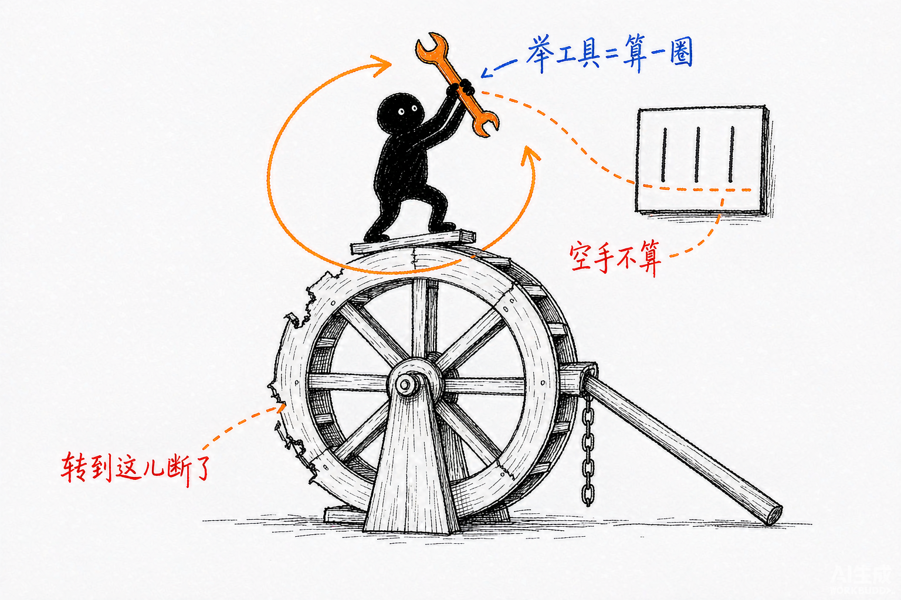

> 循环自己转圈，但只有手里真拿了工具的那圈才计数，空手说话的那圈不算。


### 03.1 循环只有五步

官方文档 `agent-loop.md` 把循环拆成五步，很干净：

| 步 | 官方动作 |
|---|---|
| 1 | Receive prompt（收到你的 prompt） |
| 2 | Evaluate and respond（评估并回应） |
| 3 | Execute tools（执行工具） |
| 4 | Repeat（重复 2-3） |
| 5 | Return result（返回结果） |

官方原话：

> Claude evaluates your prompt, calls tools to take action, receives the results, and repeats until the task is complete.
> （Claude 评估你的 prompt，调用工具采取行动，拿到结果，然后重复这个过程直到任务完成。）

画成时序更清楚：

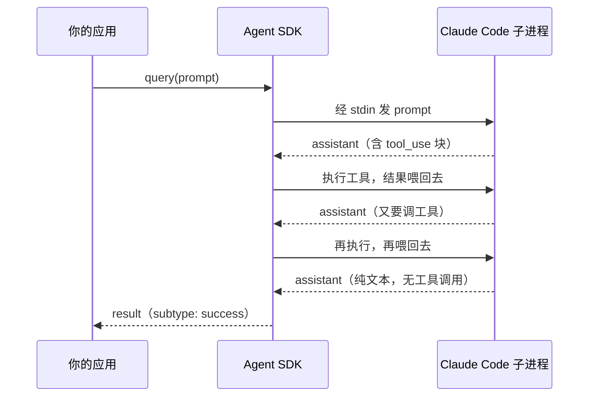

判断循环结束的信号只有一个：**Claude 产出了一个不带工具调用的响应**。

### 03.2 maxTurns 数的是什么，大部分人搞错了

这一节是全章最容易搞错的地方。我把它列成表：

| 常见误解 | 官方事实 | 标叔的结论 |
|---------|---------|-----------|
| `maxTurns` 默认 100 | 默认**无限制** | 100 只是示例值，别当默认值 |
| 一轮对话算一个 turn | 只数**含工具调用**的轮 | 最后那句纯文本不计数 |
| 设 100 就会跑满 100 轮 | 任务完成立刻停 | 它是天花板，不是目标 |

官方原文两句话，看起来矛盾，其实不矛盾：

> Each full cycle is one turn.
> （每个完整循环算一个 turn。）

> `maxTurns` counts tool-use turns only.
> （maxTurns 只统计含工具调用的 turn。）

官方举的例子：一次任务用了四个 turn，其中三个带工具调用，最后一个是纯文本响应。按 `maxTurns` 的口径，只算 3。

那为什么官方案例里普遍写 100？

我的判断是：**防御性设置**。SDK 不替你决定上限，但放任一个 Agent 无限转圈，成本会失控。设一个 100，是给自己兜底。

> **注意**：不设 `maxTurns` 不等于安全
>
> 官方文档在 hosting 章节专门提了一句：会话不会自己超时。
> 原话是 "An agent session will not timeout, but consider setting a maxTurns property to prevent Claude from getting stuck in a loop."
> （agent 会话不会超时，但建议设 maxTurns 防止 Claude 卡在循环里。）
>
> 换句话说：**不设上限，等于把信用卡交给它**。

### 03.3 循环怎么断，看 result 的 subtype

`result` 消息的 `subtype` 字段，就是循环的死因报告。一共五种：

| subtype | 什么意思 | 标叔的结论 |
|---------|---------|-----------|
| `success` | 正常完成 | 只有它有 `result` 字段 |
| `error_max_turns` | 撞上 maxTurns 上限 | 任务没干完，要么加轮次要么拆任务 |
| `error_max_budget_usd` | 撞上金额上限 | 成本爆了，查一下是不是卡循环了 |
| `error_during_execution` | 执行中被打断 | 比如 API 挂了，或者你主动中断 |
| `error_max_structured_output_retries` | 结构化输出重试超限 | schema 写太严了，§09 细讲 |

这里有个坑，很多人中招：

> **注意**：`result` 字段只在 `success` 时存在
>
> 官方文档原文："The `result` field (the final text output) is only present on the success variant."
>
> 也就是说，失败的时候 `message.result` 是 undefined。
> 你如果直接 `console.log(message.result)`，成功时好好的，失败时打出一个 undefined，然后你开始怀疑人生。
>
> 正确的写法是先判 subtype：
> ```typescript
> if (message.type === 'result') {
>   if (message.subtype === 'success') {
>     console.log(message.result);        // 只有这里有值
>   } else {
>     console.error('挂了:', message.subtype);
>   }
>   console.log('花了: $' + message.total_cost_usd);   // 这个所有 subtype 都有
> }
> ```

好消息是：不管成功失败，`total_cost_usd`、`usage`、`num_turns`、`session_id` 这四个字段都在。

钱花了多少，转了多少圈，会话 ID 是什么 —— 一律可查。

### 03.4 上下文会自己变短

Agent 转圈转久了，对话历史会越来越长。长到一定时候，模型上下文装不下了。

SDK 的处理是自动压缩：

> When the context window approaches its limit, the SDK automatically compacts the conversation: it summarizes older history to free space.
> （当上下文窗口接近上限时，SDK 会自动压缩对话：把较早的历史做摘要，腾出空间。）

压缩发生的时候，你会收到一条 `system` 消息，`subtype` 是 `compact_boundary`。

这件事有两面性：

好处是你不用管，长任务能一直跑下去。

坏处是**压缩是有损的**。早期的细节会被摘要掉。如果你的任务依赖很久之前的某句话，压缩之后它可能就只剩个大概了。

> **标叔的经验**：一个可操作的判断
>
> 如果你的任务能在 20 轮以内干完，不用管压缩。
> 如果要跑几十上百轮，那就别指望靠上下文传递信息。
> 把关键信息写进文件，让 Agent 去读文件，而不是指望它记住。
>
> 这个思路后面 §08 讲多 Agent 编排时还会回来 —— 子 Agent 的上下文隔离，本质上是一回事。

---

循环、计数、边界，这三样看明白了，你已经能判断一个 Agent 任务"为什么卡住"。

但还缺一样：它手上到底有哪些工具，谁能用，谁不能用。

下一章开始进入 Part 2，我们讲工具与权限。

---

## Part 2: 核心能力

五章。每章一个能力，每个能力锚定一个官方案例。

---

## §04 权限不是开关，是五道安检门

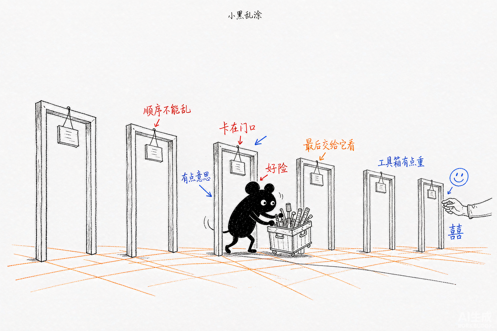

> 一次工具动作要按顺序穿过好几道门，最后一道可以把决定权交回给人。


### 04.1 先给结论：检查是有顺序的

大部分人以为权限就是一个开关：允许，或者不允许。

不是。官方文档 `permissions.md` 给了一个明确的顺序：

> When Claude requests a tool, the SDK checks permissions in this order: 1. Hooks → 2. Deny rules → 3. Permission mode → 4. Allow rules → 5. canUseTool callback
> （当 Claude 请求一个工具时，SDK 按这个顺序检查权限：1. Hooks → 2. 拒绝规则 → 3. 权限模式 → 4. 允许规则 → 5. canUseTool 回调。）

画出来是这样：

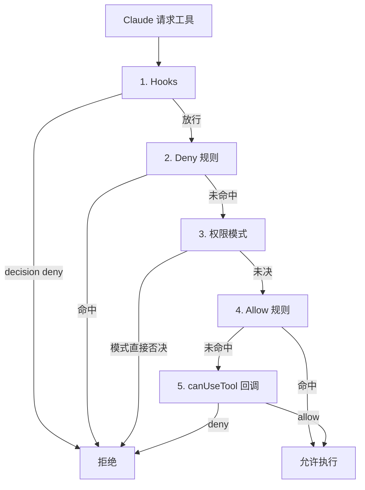

记住这张图。后面所有权限相关的困惑，回到这张图上对一遍就清楚了。

### 04.2 六种权限模式

| 模式 | 官方行为 | 标叔的结论 |
|------|---------|-----------|
| `default` | 无自动批准，未匹配的工具触发 canUseTool | 默认值，从它开始 |
| `acceptEdits` | 文件编辑和文件系统操作自动批准 | 改代码场景最省心 |
| `plan` | 只跑只读工具，Claude 只分析不改文件 | 想先看方案再动手就用它 |
| `dontAsk` | 未预先批准的**一律拒绝**，canUseTool 永不调用 | 无人值守场景，最保守 |
| `bypassPermissions` | 所有工具无需确认直接跑 | 官方原话：use with caution |
| `auto` | 用小模型分类器逐个批准或拒绝（**仅 TypeScript**） | 想要自动化又不敢全放 |

两个细节值得展开：

**第一，`bypassPermissions` 会绕过 `allowedTools` 的限制。** 官方原话是 "Every tool is approved, not just the ones you listed"（每个工具都被批准，不只是你列出的那些）。这跟很多人的直觉相反 —— 以为开了 bypass 再配 allowedTools 还能收窄，其实不会。

**第二，子 Agent 会继承权限模式。** 父 Agent 用 `bypassPermissions`、`acceptEdits` 或 `auto` 时，所有子 Agent 继承，且**无法单独覆盖**。

> **注意**：`acceptEdits` 有作用域限制
>
> 它只自动批准工作目录内，或者 `additionalDirectories` 里列出的路径。
> 目录外的路径、受保护路径，照样会弹提示。
> 这条官方写在 permissions.md 里，不算显眼。

### 04.3 allowedTools 和 tools，看着像，其实不是一回事

这是本节最容易被忽略的一条。官方原文：

> `tools` and bare-name `disallowedTools` entries change **availability**. `allowedTools` and scoped `disallowedTools` rules change **permission** only.
> （`tools` 和裸名 `disallowedTools` 改变**可用性**；`allowedTools` 和带作用域的 `disallowedTools` 只改变**权限**。）

翻译成人话：

| 配置 | 效果 | 标叔的结论 |
|------|------|-----------|
| `tools: ["Read","Grep"]` | Claude 的上下文里**只出现**这两个工具，其他全被移除 | 想彻底禁掉某个工具用它 |
| `allowedTools: ["Bash"]` | Bash 在，且自动批准，其他工具还在但要走审批 | 只想免确认，用它 |
| `disallowedTools: ["Bash"]` | Bash 从请求里移除，Claude **看不见**它 | 等于 tools 的反向写法 |
| `disallowedTools: ["Bash(rm *)"]` | Bash 还在，但匹配 `rm *` 的调用被拒 | 想禁某个**用法**而非整个工具 |

最后一行是个狠招。加了作用域的 deny 规则，**在所有模式下都生效**，包括 `bypassPermissions`。

这是唯一一个能穿透 bypassPermissions 的手段。做安全加固时记住它。

### 04.4 canUseTool：把决定权拿回自己手里

前四道门都是配置。第五道门是代码，也是唯一一道能跟真人互动的。

```typescript
canUseTool: async (toolName: string, input: any) => {
  // 你可以在这里做任何事：弹窗、发消息、查数据库
  return {
    behavior: 'allow' | 'deny',
    updatedInput?: any,     // 仅 allow 时有意义，可以改 Claude 传的参数
    message?: string        // deny 时给 Claude 一个理由
  };
}
```

注意 `updatedInput` 这个字段。它不只是"批准"，而是**批准并改写**。

Claude 想读 `/etc/passwd`？你可以 approve 但把路径改成 `/safe/demo.txt`。Claude 拿到的是你改后的结果，它还以为自己读到了想要的东西。

### 04.5 案例：让 Agent 学会先请示再动手

官方案例 `ask-user-question-previews` 把这个能力用到了极致。它做一个品牌助手，但**先问清楚再干活**。

核心代码骨架（我加了注释）：

```typescript
const q = query({
  prompt,
  options: {
    model: "sonnet",
    systemPrompt: "你是一个品牌顾问，先问清客户偏好再动手",
    permissionMode: "plan",                    // 关键：只读模式，逼它先规划
    tools: ["AskUserQuestion"],                // 关键：只给提问工具，堵死其他路
    toolConfig: {
      askUserQuestion: { previewFormat: "html" }  // 每个选项带 HTML 预览卡片
    },
    canUseTool: async (toolName, input) => {
      if (toolName !== "AskUserQuestion") {
        return { behavior: "deny", message: "这个场景下只能提问" };
      }
      // 逐个问题推送到浏览器，等用户点选
      for (const q of input.questions) {
        const answer = await askUserOverWebSocket(q);   // 阻塞在这里等人
        answers[q.question] = answer;
      }
      return { behavior: "allow", updatedInput: { questions, answers } };
    }
  }
});
```

三个设计叠加在一起，效果很漂亮：

**第一，`permissionMode: "plan"`** —— 让 Claude 进入只读模式，它没法直接动手，只能先规划。

**第二，`tools: ["AskUserQuestion"]`** —— 用 `tools`（不是 `allowedTools`）把工具表收窄到只剩提问工具。没有别的路可走，它只能问。

**第三，`canUseTool` 里阻塞等用户** —— 服务端把问题通过 WebSocket 推给浏览器，然后 `await` 住。用户点选之后 Promise 才 resolve。

这三条单独拿出来都不稀奇。组合在一起，就做出了"Agent 主动向人请示"的完整回环。

> **标叔的经验**：这个案例里有个细节，我第一次读的时候漏了。
>
> 它的 `canUseTool` 是用一个 `pending` Map 存 Promise 的 resolver 的。
> 浏览器回答时按 id 找到 resolver 调用它。
> 如果连接断掉，它会 reject 掉所有挂起的 Promise，防止永久悬挂。
>
> 这个细节官方 README 里没写，是读源码才看到的。
> **做长连接的人机交互，这个防悬挂处理不能省。**

---

权限这道门守住了 Agent 的边界。但光有内置工具不够，你得能给它造新工具。

下一章讲怎么造。

---

## §05 给 Agent 造工具，两条路别选错


> 给 Agent 造新本领有两条路：装一台要通电的机器（MCP），或贴一张靠它自读的说明书（Skill）。


### 05.1 先给结论：两条路

| 路 | 形态 | 谁执行 | 适合什么 |
|---|------|--------|---------|
| MCP server | 代码（TypeScript / Python 函数） | 你的代码 | 要调 API、查数据库、做计算 |
| Skills | Markdown 文件 | Claude 自己 | 要给它领域知识和操作流程 |

一句话区分：**MCP 给它新的手，Skills 给它新的脑子。**

### 05.2 第一条路：进程内 MCP server

先说一个事实，很多人不知道：

> [SDK MCP server] runs in-process inside your application, not as a separate process.
> （SDK MCP server 跑在你的应用进程内，不是独立进程。）

—— 官方文档 `custom-tools.md`

记住这句话。你在 §01 建立的"SDK spawn 子进程"心智模型，对 MCP server **不成立**。工具本身是在你的进程里跑的，只有 Claude 那一侧是子进程。

造一个工具，四样东西：名字、描述、入参 schema、处理函数。

```typescript
import { tool, createSdkMcpServer } from '@anthropic-ai/claude-agent-sdk';
import { z } from 'zod';

export const emailServer = createSdkMcpServer({
  name: "email",                 // 必填
  version: "1.0.0",              // 必填
  tools: [
    tool(
      "search_inbox",                                          // 名字
      "Search emails using Gmail-style query syntax",          // 描述，Claude 靠它决定要不要用
      {                                                        // Zod schema，TypeScript 必须用 Zod
        gmailQuery: z.string().describe("如 from:boss is:unread")
      },
      async (args) => {                                        // 处理函数
        const results = await searchMyInbox(args.gmailQuery);
        return {
          content: [{ type: "text", text: JSON.stringify(results) }]
        };
      }
    )
  ]
});
```

然后塞进 options：

```typescript
options: {
  mcpServers: { "email": emailServer },
  allowedTools: ["mcp__email__search_inbox"]   // 注意这个命名格式
}
```

工具名有个固定格式：`mcp__<server名>__<工具名>`。两个下划线分隔，三段。

官方案例 email-agent 里，完整的形态是这样的（来自 `email-agent/ccsdk/custom-tools.ts`）：

```typescript
export const customServer = createSdkMcpServer({
  name: "email",
  version: "1.0.0",
  tools: [
    tool("search_inbox", "Search the inbox", { gmailQuery: z.string() }, async (args) => ({...})),
    tool("read_emails", "Read multiple emails by id", { ids: z.array(z.string()) }, async (args) => ({...}))
  ]
});
```

返回值的 `content` 数组，官方支持三种元素：

| 类型 | 结构 | 标叔的结论 |
|------|------|-----------|
| `text` | `{ type: 'text', text: string }` | 90% 的场景够用 |
| `image` | `{ type: 'image', data: string, mimeType: string }` | data 是 **base64**，没有 URL 字段 |
| `resource` | `{ type: 'resource', resource: { uri, text } }` | 带来源的文件内容 |

> **注意**：image 没有 URL 字段
>
> 想让 Claude 看图，必须传 base64 字符串。
> 官方结构里就是没有 url 这个选项，别去找了。
> 我在事实核对时专门确认过这一条。

### 05.3 外接 MCP server 怎么选传输

如果是别人写好的 MCP server，你只是接进来，那要选传输方式。官方给了很干脆的三句判断：

> If the docs give you a command to run, use **stdio**. If the docs give you a URL, use **HTTP or SSE**. If you're building your own tools in code, use an **SDK MCP server**.
> （文档给你命令就用 stdio；文档给你 URL 就用 HTTP 或 SSE；自己写代码造工具就用 SDK MCP server。）

| 传输 | 什么时候用 | 配置形态 |
|------|-----------|---------|
| stdio | 本地进程，文档给了启动命令 | `{ command, args, env? }` |
| http | 远程 HTTP 服务 | `{ type: "http", url }` |
| sse | 远程 SSE 服务 | `{ type: "sse", url }` |

有个小坑：`.mcp.json` 配置文件里写 `"streamable-http"` 是可以的，但程序化选项里**只接受 `"http"`**。前者是别名，后者才是正式名。

### 05.4 第二条路：Skills

Skills 就是一堆 Markdown 文件，放在约定目录里。

```text
.claude/skills/my-skill/
└── SKILL.md
```

官方定义：

> Agent Skills extend Claude with specialized capabilities that Claude autonomously invokes when relevant. Skills are packaged as SKILL.md files containing instructions, descriptions, and optional supporting resources.
> （Skills 用专业能力扩展 Claude，Claude 在相关时自主调用。以 SKILL.md 文件打包，含指令、描述和可选的支持资源。）

加载来源有三个：`~/.claude/skills/`（用户级）、`<cwd>/.claude/skills/`（项目级）、以及父目录一直到仓库根。

要控制加载哪些来源，用 `settingSources`：

```typescript
options: {
  settingSources: ['project']    // 'user' | 'project' | 'local'
}
```

不写 `settingSources` 等价于 `["user", "project", "local"]` 三个都加载。

官方案例 `resume-generator` 就是这么玩的：

```typescript
options: {
  settingSources: ['project'],              // 让 Agent 能读到 .claude/skills/docx/
  allowedTools: ['Skill', 'WebSearch', 'WebFetch', 'Bash', 'Write', 'Read', 'Glob'],
  systemPrompt: "研究这个人，生成一份一页纸的 .docx 简历"
}
```

`.claude/skills/docx/` 下面放的是 docx 这个库的完整用法说明。Agent 要生成 Word 文件时，自己去翻这份文档，然后照着写脚本。

> **注意**：SDK 里 `allowed-tools` 这个 frontmatter 字段**不支持**
>
> 官方 skills.md 明确写了这一点。
> 在 Claude Code 里你能用 frontmatter 限制 skill 激活时可用哪些工具，在 SDK 里这个字段不生效。
> 要限制工具，回到 §04 那套 `tools` / `allowedTools`。

### 05.5 怎么选，一张表

**先说清楚**：官方文档里没有直接对比过 MCP 和 Skills 的适用场景。下面这张表是我基于两个案例的用法和官方文档的各自描述，自己归纳的判断。

| 你的需求 | 选什么 | 理由 |
|---------|--------|------|
| 要调公司内部 API | MCP | 代码能鉴权、能错误处理，Markdown 做不到 |
| 要查数据库 | MCP | 同上 |
| 要做精确计算 | MCP | 别让模型算，让它调你的函数 |
| 要教它一套操作流程 | Skill | 流程是文字，写成 Markdown 最自然 |
| 要教它某个库的用法 | Skill | resume-generator 的 docx skill 就是这个 |
| 要它遵守公司规范 | Skill | 写进 CLAUDE.md 或 skill 里 |
| 两者都要 | 都用 | email-agent 就是 MCP + Skills 混合 |

一个实用的判断法：**问自己"这件事 Claude 自己做会不会出错"**。

会出错的（算数、调 API、精确格式化），写成 MCP，让它调你的代码。

不会出错的（写文案、按流程组织、理解领域概念），写成 Skill，让它自己读。

---

工具造好了，Agent 手上有活可干了。

但有个问题你还没解决：它动手之前，你怎么知道它要干什么？

下一章讲 Hooks。

---

## §06 Hooks 让你在它动手前一刻插手


> 有个时机能插手，就在动作落下前的那一瞬——可以改、可以挡、可以放行。


### 06.1 Hooks 在权限链的最前面

回到 §04 那张五道门的图。Hooks 排第一，在 Deny 规则之前。

这意味着：Hook 说不行，后面的规则根本没机会发言。

时机是这样：

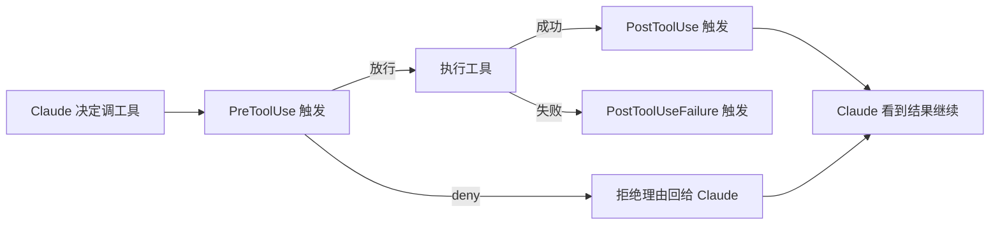

### 06.2 十几种事件，常用的就五个

官方列了一长串，我按使用频率排：

| 事件 | 什么时候触发 | 标叔的结论 |
|------|-------------|-----------|
| `PreToolUse` | 工具调用**请求发出时**，可阻止可改写 | 用得最多，本章重点 |
| `PostToolUse` | 工具执行**返回结果时** | 做日志、做审计 |
| `PostToolUseFailure` | 工具执行失败时 | 错误兜底 |
| `SubagentStop` | 子 Agent 完成时 | 做多 Agent 进度追踪 |
| `PreCompact` | 上下文压缩发生前 | 抢救关键信息 |
| `Stop` | Agent 停止时 | 收尾、清理 |
| `UserPromptSubmit` | 用户提交 prompt 时 | 做输入过滤 |
| `PermissionRequest` | 将要弹权限确认框时 | 接管审批 UI |

剩下 `SessionStart`、`SessionEnd`、`Notification`、`Setup`、`TeammateIdle`、`TaskCompleted`、`ConfigChange`、`WorktreeCreate`、`WorktreeRemove` 这些，官方标注**仅 TypeScript 可用**。

### 06.3 matcher：一个 regex，默认全匹配

```typescript
{
  matcher: "Write|Edit|MultiEdit",   // regex，竖线表示"或"
  hooks: [myHook],                    // 回调数组，必填
  timeout: 60                         // 默认 60 秒
}
```

三点要注意：

**第一，matcher 是 regex 字符串**，不写就匹配全部事件。

**第二，工具类 Hook 只按工具名匹配，不按文件路径。** 想在 PreToolUse 里按文件名过滤？做不到，只能在 hook 函数里自己判断。

**第三，MCP 工具的名字是 `mcp__<server>__<action>`**。要拦你自己造的 email 工具的 search_inbox，matcher 得写 `mcp__email__search_inbox`。

### 06.4 返回值：以前是三个字段，现在是嵌套结构

这一节有个坑，值得单独讲。

老写法（官方案例 hello-world 里用的）是扁平的：

```typescript
// 老写法，很多示例还在用
return { continue: true };                                    // 放行
return { decision: 'block', stopReason: '原因', continue: false };  // 拦截
```

新写法（官方文档 `hooks.md` 现在的写法）是嵌套的：

```typescript
// 新写法
return {};                                    // 放行
return {
  continue: false,                            // 顶层：是否让 Agent 继续跑
  systemMessage: '给用户看的提示',              // 顶层
  hookSpecificOutput: {                       // 嵌套：控制当前这次操作
    hookEventName: 'PreToolUse',
    permissionDecision: 'deny',               // allow | deny | ask | defer
    permissionDecisionReason: '不能改 .env 文件',
    updatedInput: { /* 改写工具入参 */ }
  }
};
```

| 字段 | 位置 | 作用 |
|------|------|------|
| `continue` | 顶层 | false 则整个 Agent 停下来 |
| `systemMessage` | 顶层 | 给用户看的消息 |
| `permissionDecision` | `hookSpecificOutput` 内 | 决定这次工具调用 allow/deny/ask/defer |
| `permissionDecisionReason` | `hookSpecificOutput` 内 | 拒绝理由，会回传给 Claude |
| `updatedInput` | `hookSpecificOutput` 内 | 改写工具入参 |
| `additionalContext` | `hookSpecificOutput` 内（PostToolUse） | 追加上下文给 Claude |
| `updatedToolOutput` | `hookSpecificOutput` 内（PostToolUse） | 改写工具返回值 |

多个 Hook 并行执行时，优先级是：

> **deny > defer > ask > allow**

官方的说法是 "most restrictive wins"（最严格的那个赢）。

> **注意**：Python 里 `continue` 要写成 `continue_`
>
> 因为 `continue` 是 Python 关键字。官方 Python 文档里写的是 `{'continue_': True}`。
> 这个下划线很容易漏，漏了不报错，只是静默失效。

### 06.5 案例：hello-world 的写文件围栏

官方案例 hello-world 里那个 Hook，做的事很朴素：

**Claude 想写 `.js` 或 `.ts` 文件？只允许写到 `agent/custom_scripts/` 目录，别处一律拦下。**

```typescript
hooks: {
  PreToolUse: [{
    matcher: "Write|Edit|MultiEdit",
    hooks: [
      async (input) => {
        const toolName = input.tool_name;
        const filePath = input.tool_input?.file_path || '';
        const ext = path.extname(filePath).toLowerCase();

        if (ext === '.js' || ext === '.ts') {
          const allowed = path.join(process.cwd(), 'agent', 'custom_scripts');
          if (!filePath.startsWith(allowed)) {
            return {
              decision: 'block',
              stopReason: '脚本文件必须写到 custom_scripts 目录',
              continue: false
            };
          }
        }
        return { continue: true };
      }
    ]
  }]
}
```

逻辑不复杂。**价值在于思路**：用代码给 Agent 划一个笼子，笼子外面它怎么跑都行，笼子边界由你定。

官方文档里还给了几个同思路的变体，都值得抄：

| 用例 | 做法 | 官方出处 |
|------|------|---------|
| 禁止改 `.env` | PreToolUse 检查路径后缀，deny | hooks.md |
| 路径重定向 | `updatedInput` 改写路径，**必须同时设** `permissionDecision: 'allow'` | hooks.md |
| 阻断 `/etc` 写入 | deny + `systemMessage` 提示用户 | hooks.md |
| 自动批准只读工具 | PreToolUse 里对 Read/Grep/Glob 返回 allow | hooks.md |
| 子 Agent 追踪 | PreToolUse/PostToolUse 记录，用 `agent_id` 归属 | hooks.md |

第二个用例有个隐藏要求，我单独拎出来：

> **注意**：`updatedInput` 必须配 `permissionDecision: 'allow'`
>
> 光返回 `updatedInput` 不够。
> 官方明确说要同时设 `permissionDecision: 'allow'`，否则改写不生效。
> 这个组合要求在文档里藏得挺深。

### 06.6 案例：research-agent 用 Hook 做子 Agent 追踪

`research-agent` 这个案例里，Hook 不是用来拦截的，是用来**做可观测性**的。

它想解决一个问题：主 Agent 派了三个子 Agent 出去干活，我怎么知道每个子 Agent 干了什么？

做法是在 PreToolUse 里，用 `tool_use_id` 当线索，把每次工具调用归属到对应的子 Agent：

```python
async def pre_tool_use_hook(self, hook_input, tool_use_id, context):
    tool_name = hook_input['tool_name']
    # 当前是否处在某个子 Agent 的上下文里
    is_subagent = self._current_parent_id and self._current_parent_id in self.sessions

    if is_subagent:
        session = self.sessions[self._current_parent_id]
        record = ToolCallRecord(
            tool_name=tool_name,
            tool_input=hook_input.get('tool_input'),
            tool_use_id=tool_use_id,
            subagent_type=session.subagent_type,
            parent_tool_use_id=self._current_parent_id   # 这条线索是关键
        )
        session.tool_calls.append(record)
        self.tool_call_records[tool_use_id] = record
    return {'continue_': True}   # 注意下划线
```

然后在 PostToolUse 里，用 `tool_use_id` 把记录捞回来，补上输出：

```python
record = self.tool_call_records.get(tool_use_id)
if record:
    record.tool_output = hook_input.get('tool_response')
```

**为什么 `tool_use_id` 能当线索？** 因为官方保证了同一次工具调用的 Pre 和 Post 拿到的是同一个 ID。官方原话是 hook 入参的第二项是 "tool use ID（关联 Pre/Post）"。

这个技巧在 §08 讲多 Agent 编排时还要用。

---

Hooks 让你能插手单次的动作。但如果你要的是"记住上一轮说过什么"，那就是另一回事了。

下一章讲多轮会话 —— 这是全书技术密度最高的一章。

---

## §07 多轮会话三条路，官方刚封死一条

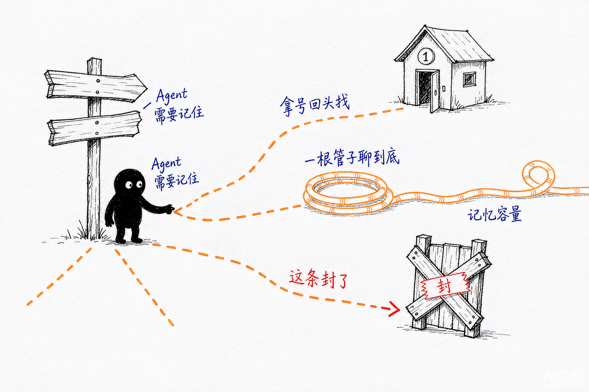

> 让对话接得上共有三条路，第三条已被官方用木板钉死，只剩两条能走。


### 07.1 先给结论

`query()` 默认每次调用都是一个**新会话**。你说过的话，它不记得。

想让它记住，官方给了三条路。但其中一条已经在最新版本被移除了：

| 范式 | 机制 | 案例 | 状态 |
|------|------|------|------|
| A. `resume` / `continue` | 靠 session_id 从磁盘恢复历史 | email-agent | 可用 |
| B. 长连接流式输入 | 一个 query 长期活着，往里推消息 | simple-chatapp | **官方首选** |
| C. V2 Session API | `createSession()` + `send()` / `stream()` | hello-world-v2 | **已移除** |

第三条路被封这件事，得先讲清楚，因为官方案例仓库里那个 demo 还在。

### 07.2 范式 A：靠 session_id 恢复

**session_id 从哪来？** 每个 `result` 消息都带，不管成功失败。

TypeScript 里更早能拿到 —— `system` 消息的 `init` 阶段就带 `session_id`，是顶层直接字段。Python 里则嵌套在 `SystemMessage.data` 里。

```typescript
let sessionId: string | undefined;

for await (const msg of q) {
  // TypeScript：init 消息上直接读，比等 result 早
  if (msg.type === 'system' && msg.subtype === 'init') {
    sessionId = msg.session_id;
  }
  if (msg.type === 'result') {
    sessionId = msg.session_id;    // result 上也有，两个来源一致
  }
}
```

下次开新一轮，把 id 传回去：

```typescript
const q2 = query({
  prompt: "刚才那个方案，再加上错误处理",
  options: { resume: sessionId }     // 这行是关键
});
```

背后发生了什么？

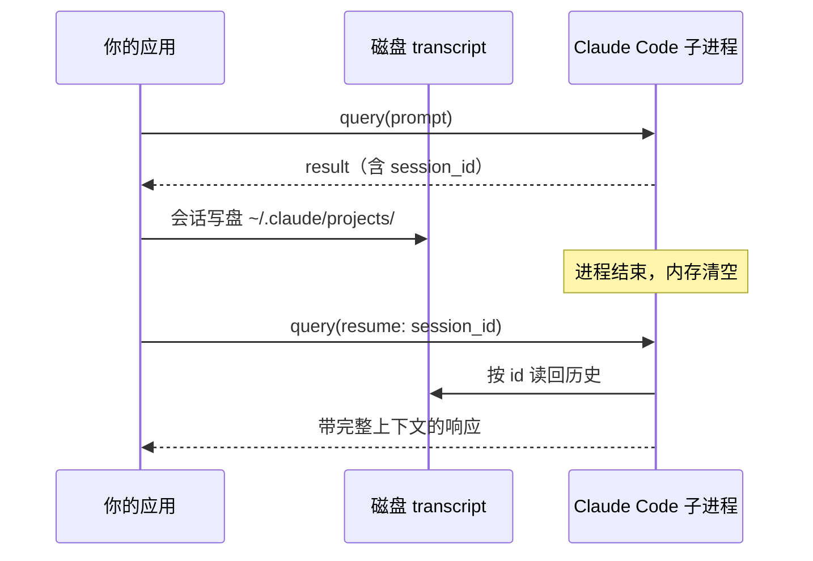

**transcript 存在哪？** `~/.claude/projects/<encoded-cwd>/*.jsonl`。

注意 `<encoded-cwd>` 这一截：它是把你的工作目录绝对路径里所有非字母数字字符替换成 `-` 得到的。

> **注意**：resume 失败，九成是 cwd 对不上
>
> 官方文档专门点出了这个坑。目录编码是 cwd 算出来的，两次调用的 cwd 不一致，就会去错地方找文件。
> 结果不是报错，而是**静默开了一个新会话** —— Claude 表现得像是失忆了，但代码不报错。
>
> 这个症状很有迷惑性。排查的时候先看 cwd。

**`continue` 和 `resume` 的区别**：

| 选项 | 语义 | 要不要 id |
|------|------|----------|
| `continue: true` | 恢复当前目录**最近**那次会话 | 不要 |
| `resume: sessionId` | 恢复**指定**那个会话 | 要 |

单会话的命令行工具用 `continue` 够了。多用户、多会话的服务，必须用 `resume`。

还有两个配套选项：

- `forkSession: true` —— 复制一份历史，另起一个新会话。适合"从这个节点分叉试试别的方案"。
- `persistSession: false` —— 不落盘（**仅 TypeScript**）。临时会话、隐私敏感场景用。

### 07.3 范式 B：长连接流式输入（官方首选）

官方文档 `streaming-input.md` 开头第一句，态度很明确：

> Streaming input mode is the preferred way to use the Claude Agent SDK.
> （流式输入模式是使用 Claude Agent SDK 的首选方式。）

理由也写得很直接：

> It allows the agent to operate as a long lived process that takes in user input, handles interruptions, surfaces permission requests, and handles session management.
> （它让 agent 作为长生命周期进程运行：接收用户输入、处理中断、暴露权限请求、管理会话。）

做法是：`prompt` 不传字符串，传一个异步迭代器。

```typescript
// 一个能被持续 push 的消息队列
const queue = new MessageQueue();

// 这一次 query 会长期活着
const outputIterator = query({
  prompt: queue as any,                  // 关键：传异步迭代器而不是字符串
  options: { maxTurns: 100, model: 'opus', allowedTools: [...] }
})[Symbol.asyncIterator]();

// 用户每说一句话，就往队列里推一条
queue.push({ type: 'user', message: { role: 'user', content: '把按钮改成蓝色' } });
```

官方案例 simple-chatapp 就是这个架构。它启动一次 `query()`，然后整个聊天过程都复用这同一个会话。

单消息模式（传字符串）做不到什么？官方列了六条：

| 能力 | 单消息模式 | 流式输入模式 |
|------|-----------|-------------|
| 图片附件 | 不支持 | 支持 |
| 动态消息队列 | 不支持 | 支持 |
| 实时中断 | 不支持 | 支持 |
| Hooks | 不支持 | 支持 |
| 多轮对话 | 不支持 | 支持 |
| 上下文持久化 | 不支持 | 支持 |

这张表基本就是在说：想做正经的产品，走流式输入。

### 07.4 范式 C：V2 Session API —— 已经封了

官方案例仓库里有个 `hello-world-v2` 目录，演示一套很漂亮的 API：

```typescript
await using session = unstable_v2_createSession({ model: 'sonnet' });
await session.send('Hello!');                    // 发
for await (const msg of session.stream()) { }    // 收
await using resumed = unstable_v2_resumeSession(sessionId, { model: 'sonnet' });
```

`send()` 和 `stream()` 分开，语义很干净。还用了 TS 5.2 的 `await using` 自动释放资源。

**但是，这套 API 已经被移除了。**

官方文档 `typescript-v2.md` 第一句就是：

> TypeScript Agent SDK 0.3.142 removes `unstable_v2_createSession`, `unstable_v2_resumeSession`, `unstable_v2_prompt`.
> （TypeScript Agent SDK 0.3.142 移除了这三个 API。）

`sessions.md` 里也补了一句：

> The experimental V2 session API, which provided `createSession()` with a send / stream pattern, was removed in TypeScript Agent SDK 0.3.142.

也就是说，**只有 0.2.x 版本能用**。你现在 `npm install` 装到 0.3.142 或更高，这段代码直接跑不起来。

> **注意**：别照抄官方案例仓库里的 hello-world-v2
>
> 这个 demo 依赖 `@anthropic-ai/claude-agent-sdk ^0.1.59`，用的是已废弃 API。
> 新项目照着抄会直接报错。
>
> 这是"案例驱动学习"的一个真实代价：**官方 demo 会过期，官方会落后于文档。**
> 我这轮核对事实的时候，就是靠读本地的 `typescript-v2.md` 才发现这条移除公告的。

那为什么还要讲它？

因为它演示的 **`send()` / `stream()` 分离**这个设计思路，比 V1 的单个 `for await` 更符合直觉。理解它，你就理解了为什么流式输入（范式 B）要设计成"往迭代器里推消息"。

另外，V2 明确不支持 `forkSession` 和部分高级流式输入模式。这也是它被移除的原因之一 —— 两套并行的会话 API，维护成本太高。

### 07.5 横向对比

| 维度 | A. resume/continue | B. 流式输入长连接 | C. V2 Session |
|------|-------------------|-----------------|---------------|
| 上下文保持 | 靠磁盘 transcript 恢复 | 进程内存里一直活着 | 进程内存 |
| 进程重启后 | 能恢复 | 不能，会话丢了 | 靠 resumeSession |
| 中断能力 | 每次 query 独立 | 支持实时 interrupt | 支持 |
| 支持图片 | 不支持 | 支持 | 部分 |
| Hooks | 支持 | 支持 | 支持 |
| 官方态度 | 稳定可用 | **首选** | **已移除** |
| 典型场景 | CLI 工具、批处理任务 | 聊天产品、长驻服务 | 别用了 |

### 07.6 怎么选

一句话：**长驻服务选 B，一次性任务选 A，C 别碰。**

具体一点：

- 你在做个聊天产品、IDE 插件、需要一直跟用户交互的东西 → **范式 B**
- 你在做个定时任务、批处理脚本、跑完就退出的工具 → **范式 A**（用 `resume` 保持跨调用的上下文）
- 你想做"跑一半，明天接着跑" → **范式 A**，因为 B 的上下文在内存里，进程一退就没了

还有一条实话：**B 和 A 不互斥**。

生产系统里常见做法是：平时用 B 保持长连接，同时在 `result` 里把 `session_id` 存下来。连接断了，用 A 的 `resume` 恢复。

> **核心建议**：不管选哪条路，先把 session_id 存下来
>
> 这是最便宜的保险。
> 每个 result 消息都带 session_id，存一下几乎零成本。
> 等哪天你需要"回到昨天那个会话"的时候，会发现这笔投入太值了。

---

单 Agent 的多轮搞清楚了。但有些活，一个 Agent 干不动。

下一章讲怎么拆成一队。

---

## §08 一个 Agent 干不完，就拆成一队

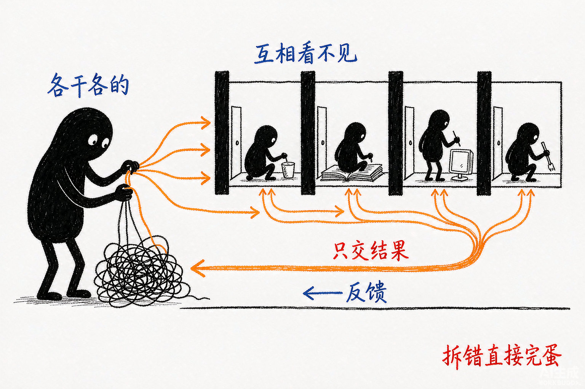

> 把一根活拆成几股，每股关进独立隔间，彼此看不见，只把结果汇回来。


### 08.1 为什么要拆

两个理由，一个关于质量，一个关于速度。

**质量**：一个 Agent 又查资料又算数据又写报告，上下文里塞满了中间过程。越到后面，越容易忘掉开头的要求。

**速度**：查资料这件事天然可以并行。三个子 Agent 同时查三个方向，比一个 Agent 挨个查快三倍。

官方案例 `research-agent` 就是冲着这两点设计的。

### 08.2 AgentDefinition：用代码定义队友

SDK 里子 Agent 是**用代码定义**的，不是一个配置文件。

TypeScript 版（本书主线）：

```typescript
const agents = {
  "researcher": {
    description: "需要搜集某个主题的研究资料时使用这个 agent",  // 必填，主 Agent 靠它决定派给谁
    tools: ["WebSearch", "Write"],                            // 收窄工具，只给需要的
    prompt: researcherPrompt,                                  // 必填，子 Agent 的 system prompt
    model: "haiku"                                             // 可以用便宜的小模型
  },
  "data-analyst": {
    description: "在 researcher 完成后做量化分析和可视化",
    tools: ["Glob", "Read", "Bash", "Write"],
    prompt: dataAnalystPrompt,
    model: "haiku"
  },
  "report-writer": {
    description: "需要产出正式研究报告文档时使用",
    tools: ["Skill", "Write", "Glob", "Read", "Bash"],
    prompt: reportWriterPrompt,
    model: "haiku"
  }
};

const q = query({
  prompt: userRequest,
  options: { agents, allowedTools: ["Agent"], model: "opus" }
});
```

Python 版（`research-agent` 案例里的真实写法）：

```python
from claude_agent_sdk import ClaudeSDKClient, ClaudeAgentOptions, AgentDefinition

agents = {
    "researcher": AgentDefinition(
        description="Use this agent when you need to gather research information on any topic.",
        tools=["WebSearch", "Write"],
        prompt=researcher_prompt,
        model="haiku"),
    "data-analyst": AgentDefinition(
        description="Use this agent AFTER researchers have completed their work to generate quantitative analysis and visualizations.",
        tools=["Glob", "Read", "Bash", "Write"],
        prompt=data_analyst_prompt,
        model="haiku"),
    "report-writer": AgentDefinition(
        description="Use this agent when you need to create a formal research report document.",
        tools=["Skill", "Write", "Glob", "Read", "Bash"],
        prompt=report_writer_prompt,
        model="haiku")
}

options = ClaudeAgentOptions(
    permission_mode="bypassPermissions",
    setting_sources=["project"],
    system_prompt=lead_agent_prompt,
    allowed_tools=["Task"],          # 注意这里用的是 Task，不是 Agent
    agents=agents,
    hooks=hooks,
    model="haiku")
```

`AgentDefinition` 的完整字段：

| 字段 | 必填 | 作用 |
|------|------|------|
| `description` | 是 | 主 Agent 靠它决定派活给谁，**写清楚是关键** |
| `prompt` | 是 | 子 Agent 的 system prompt |
| `tools` | 否 | 收窄工具；省略则继承全部 |
| `disallowedTools` | 否 | 移除特定工具 |
| `model` | 否 | 覆盖模型，可用 `inherit` |
| `skills` | 否 | 预加载的 skill 名 |
| `mcpServers` | 否 | 给子 Agent 配 MCP server |
| `maxTurns` | 否 | 子 Agent 的轮次上限 |
| `background` | 否 | 非阻塞后台任务 |
| `effort` | 否 | `low`/`medium`/`high`/`xhigh`/`max` |
| `permissionMode` | 否 | 子 Agent 内的权限模式 |

`description` 这个字段我要多说一句。它**不是注释，是调度依据**。主 Agent 看着这段描述决定这个活派给谁。写得含糊，派活就乱。

### 08.3 一个命名坑：Task 还是 Agent

官方文档 `subagents.md` 里有一行很容易滑过去：

> The Agent tool must be included in allowedTools since Claude invokes subagents through the Agent tool.
> （必须把 Agent 工具放进 allowedTools，因为 Claude 通过 Agent 工具调用子代理。）

但同一份文档后面又有一条：

> 工具名已经从 "Task" 改名为 "Agent"（Claude Code v2.1.63）。当前 SDK 在 tool_use block 里发的是 "Agent"，但在 `system:init` 的 tools 列表和 `result.permission_denials[].tool_name` 里仍然用 "Task"，**建议同时检查两者**。

也就是说，现在处于一个新旧名并存的过渡期。

| 位置 | 用的名字 |
|------|---------|
| `tool_use` block | `Agent` |
| `system:init` 的 tools 列表 | `Task` |
| `result.permission_denials[].tool_name` | `Task` |

官方案例 `research-agent` 里写的是 `allowed_tools=["Task"]`，lead_agent 的 prompt 里也通篇用 Task —— 它跟文档说的"检查两者"是一致的。

> **注意**：权限拒绝的排查要查两个名字
>
> 如果你发现子 Agent 派不出去，检查 `result.permission_denials` 的时候，
> 别只搜 "Agent"，也要搜 "Task"。
> 最稳妥的做法是 `allowedTools` 里两个名字都写上。

### 08.4 上下文隔离：这是核心设计

官方文档讲得很清楚：

> Each subagent runs in its own fresh conversation. Intermediate tool calls and results stay inside the subagent; only its final message returns to the parent.
> （每个子 Agent 运行在自己全新的会话里。中间的工具调用和结果留在子 Agent 内部，只有最终消息返回给父 Agent。）

这意味着：

**子 Agent 查了 50 个网页，父 Agent 只看到最后那段总结。** 50 个网页的内容不会污染父 Agent 的上下文。

继承与不继承的清单：

| 继承 | 不继承 |
|------|--------|
| 自己的 system prompt | 父会话的历史 |
| Agent 工具的 prompt | 父 Agent 的 system prompt |
| 项目的 CLAUDE.md | 预加载的 skill（除非列在 `AgentDefinition.skills`） |
| 工具定义 | —— |

还有一条硬规则：

> Don't include Agent in a subagent's tools array.
> （不要把 Agent 放进子 Agent 的 tools 数组。）

**子 Agent 不能再派子 Agent。** 层级就是一层。

### 08.5 案例拆解：research-agent 的四人小队

这个案例的结构很清晰：

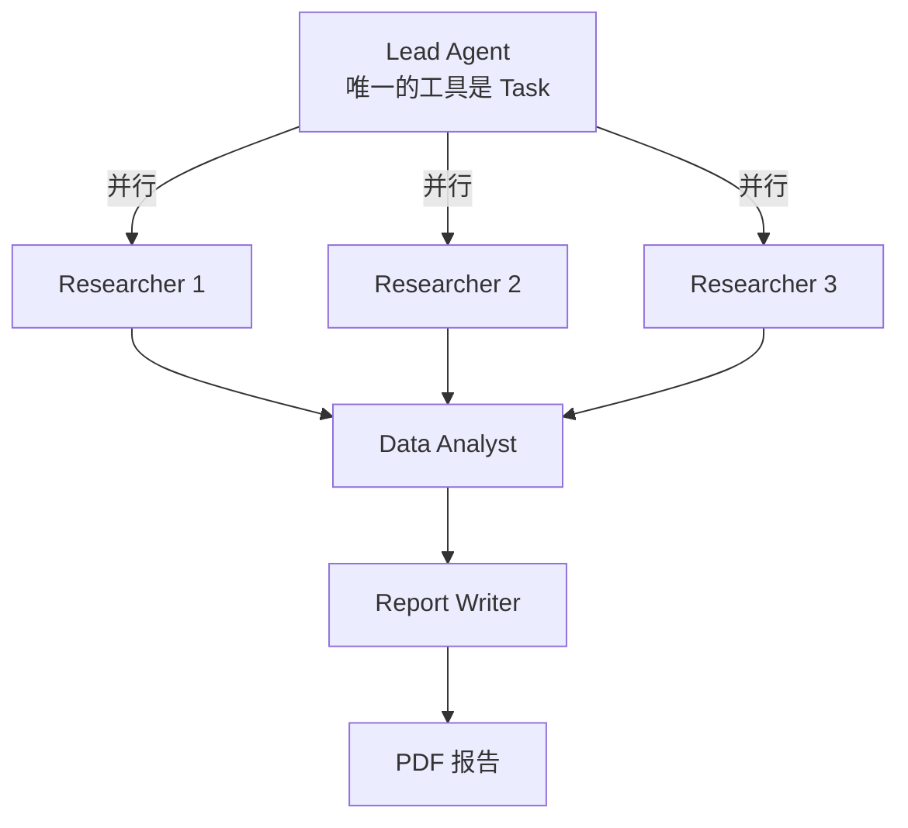

Lead Agent 的角色很极端。它的 prompt 里第一句就写死了：

> Your ONLY tool is Task — you delegate everything to subagents
> （你唯一的工具是 Task —— 所有事情都委派给子代理。）

**它自己不干活，只做调度。**

并行这件事，prompt 里强调了三次。第一次：

> STEP 2: SPAWN RESEARCHER SUBAGENTS (IN PARALLEL) — Use Task tool to spawn 2-4 researcher subagents simultaneously

第二次：

> ALWAYS spawn 2-4 researcher subagents in parallel (not sequential)

第三次最狠，直接给了正反例：

> GOOD (parallel): Spawn researcher for subtopic A / B / C — (All run simultaneously).
> BAD (sequential): Spawn A, wait … Then spawn B, wait … Then spawn C, wait

**为什么要强调三次？** 因为模型天然倾向于顺序执行。你不反复强调，它就会一个一个来。

依赖顺序也写死了：

> ALWAYS wait for ALL researchers to finish before spawning the data-analyst … ALWAYS wait for the data-analyst to finish before spawning the report-writer

三个 researcher 并行 → 全部完成后派 data-analyst → data-analyst 完成后派 report-writer。

这是个典型的**分阶段并行**：阶段内并行，阶段间串行。

### 08.6 怎么知道每个子 Agent 干了什么

子 Agent 的中间过程不回传给父 Agent。那调试的时候怎么看？

答案在 §06 已经埋下了：用 Hooks + `tool_use_id` 追踪。

`research-agent` 的 `subagent_tracker.py` 就是干这个的。核心数据结构是 `ToolCallRecord`，里面有个 `parent_tool_use_id` 字段。

派活的时候，用 Task 工具的 `tool_use_id` 作为 `parent_tool_use_id`，建一个 `SubagentSession`：

```python
# 派活时：以 Task 调用的 tool_use_id 为键，登记一个子 Agent 会话
self.sessions[tool_use_id] = SubagentSession(subagent_type=..., ...)
```

之后所有工具调用，PreToolUse hook 里判断当前上下文属于哪个子 Agent，就打上那个 `parent_tool_use_id`。

最后在 PostToolUse 里用 `tool_use_id` 捞回记录，补上输出。

**这套机制成立的唯一前提**：同一次工具调用的 Pre 和 Post 拿到的 `tool_use_id` 是同一个。官方保证了这一点。

> **标叔的经验**：这个追踪模式值得抄
>
> 多 Agent 系统最大的痛点是"它到底干了什么"。
> 子 Agent 的中间过程不回传，出了问题就是黑盒。
>
> research-agent 这套用 hook 建旁路日志的做法，成本很低，收益很大。
> 我在 §11 讲可观测性时会再提一次。

### 08.7 两种定义方式，代码优先

子 Agent 除了用代码定义，还能写成 Markdown 文件放在 `.claude/agents/` 下。

官方说得很明确：

> You can also define subagents as markdown files in `.claude/agents/` directories … Programmatically defined agents take precedence over filesystem-based agents with the same name.
> （也可以把子代理定义为 `.claude/agents/` 目录下的 markdown 文件……代码定义的 agent 优先级高于同名的文件系统定义。）

| 方式 | 优点 | 缺点 |
|------|------|------|
| 代码 `AgentDefinition` | 动态生成、优先级高、可传变量 | 改了要重启 |
| 文件 `.claude/agents/*.md` | 好维护、能版本管理、非程序员可改 | 只在会话启动时加载 |

文件方式有个坑：

> 文件系统定义的 agent 只在启动时加载，运行中新建需要重启会话。

所以生产环境里，如果你要动态决定"这次任务需要哪几个专家"，只能用代码方式。

---

到这儿，Part 2 的五章讲完了。Agent 能干活用工具，有权限边界，能插手，能记住，还能组队。

但还差最后一件事：把它放到真实产品里，会发生什么？

Part 3 讲这个。

---

## Part 3: 进阶实战

四章。从流式中断，到宿主形态，到生产化，最后收一个思维转变。

---

## §09 流式、中断，以及怎么让它按格式交作业

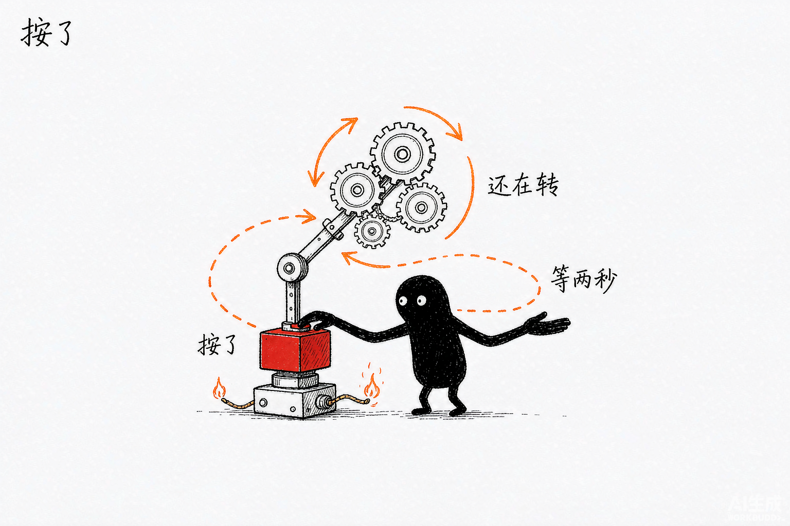

> 你发了中断，子进程却还在靠惯性转两秒才真正停，不是手指一松就停。


### 09.1 流式输入：官方推荐，不是可选优化

§07 讲过，流式输入是官方首选。这里补一个理由：

> [流式输入] allows the agent to operate as a long lived process that takes in user input, **handles interruptions**, surfaces permission requests, and handles session management.

注意加粗那两个词。中断能力，只有流式输入模式才有。

### 09.2 流式输出：打字机效果怎么做

默认你拿到的是一条条完整消息。想要"一个字一个字往外蹦"的效果，要显式开启：

```typescript
const q = query({
  prompt,
  options: {
    includePartialMessages: true    // TypeScript；Python 里是 include_partial_messages
  }
});
```

开启之后，消息流里会多出一类 `StreamEvent`。它的结构：

| 字段 | 内容 |
|------|------|
| `uuid` | 事件唯一标识 |
| `session_id` | 会话 ID |
| `event` | 原始 Claude API 事件 |
| `parent_tool_use_id` | 归属的工具调用 |

TypeScript 里类型名是 `SDKPartialAssistantMessage`，`type` 字段值是 `'stream_event'`。

增量渲染要盯这个事件：

```typescript
if (message.type === 'stream_event') {
  const event = message.event;
  if (event.type === 'content_block_delta' && event.delta.type === 'text_delta') {
    process.stdout.write(event.delta.text);   // 不换行，一个字一个字往外打
  }
}
```

完整顺序是这样的：

```text
message_start
  → content_block_start
  → content_block_delta  ← 文字在这儿，可能来几十次
  → content_block_stop
  → message_delta
  → message_stop
→ AssistantMessage        ← 完整消息
→ ...（可能有多轮工具调用）
→ ResultMessage           ← 最终结果
```

> **注意**：流式输出和扩展思考不兼容
>
> 官方文档明说：开启扩展思考（显式设 `maxThinkingTokens`）时，不会发送 StreamEvent。
> 想做打字机效果，就别开思考。
> 这两个功能是二选一。

### 09.3 中断：八个官方案例，只有一个做了

这是我这轮核对事实时最意外的一个发现。

我把 8 个官方案例的源码全过了一遍，**只有 `excel-demo` 用了 `abortController`**。剩下 7 个，全部没有中断能力。

也就是说：照着官方案例做的产品，用户点"停止"是没用的。

先说怎么用。两种方式：

**方式一：`abortController`（推荐）**

```typescript
const abortController = new AbortController();

const queryIterator = query({
  prompt,
  options: { cwd, abortController, maxTurns: 100, ... }
});

// 用户点了停止按钮
stopButton.onclick = () => abortController.abort();
```

`abortController` 是 options 的一个字段，默认值就是 `new AbortController()`。

**方式二：`interrupt()`**

```typescript
const q = query({ prompt, options });
await q.interrupt();
```

官方标注：**`interrupt()` 只在流式输入模式下可用**。

### 09.4 中断的真相：不是立刻停

这里有个细节，官方文档藏在 `typescript.md` 里，很多人不知道：

调用 `abortController.abort()` 之后，**signal 不会立刻触发**。

SDK 的做法是：

1. 先关闭子进程的 stdin
2. 等待大约 **2 秒**，让 Claude Code CLI 干净地退出
3. 然后才 abort 那个 signal

为什么要等 2 秒？为了让 CLI 有机会保存状态、清理临时文件。直接杀进程会留下垃圾。

> **注意**：要立即响应，自己监听 signal
>
> 如果你希望 UI 在用户点击的瞬间就有反馈，别等 SDK。
> 直接监听你自己的 `abortController.signal`：
> ```typescript
> abortController.signal.addEventListener('abort', () => {
>   setUiState('stopping');    // UI 立即响应
> });
> ```
> SDK 那边慢慢收尾，UI 这边先动起来。

中断之后，`result` 消息的 `subtype` 是 `error_during_execution`。

想区分"为什么停的"，看 `terminal_reason` 字段。官方列的值包括 `aborted_streaming`、`aborted_tools` 等。

### 09.5 结构化输出：让它按格式交作业

Agent 的输出是自然语言。但程序要的是结构化数据。

传统做法是 prompt 里写"请返回 JSON"，然后自己解析，还得处理各种格式错误。

SDK 给了个正经方案：

```typescript
const schema = {
  type: "object",
  properties: {
    company: { type: "string" },
    founded: { type: "number" },
    products: { type: "array", items: { type: "string" } }
  },
  required: ["company", "founded", "products"]
};

for await (const message of query({
  prompt: "研究 Anthropic 这家公司",
  options: {
    outputFormat: { type: "json_schema", schema }   // Python 里是 output_format
  }
})) {
  if (message.type === 'result' && message.subtype === 'success') {
    console.log(message.structured_output);   // 这里已经是校验过的对象
  }
}
```

SDK 会校验输出。不符合 schema 就重新 prompt 让 Claude 改。

可以用 Zod（TypeScript）或 Pydantic（Python）生成 schema，比手写 JSON Schema 舒服。

三个限制：

**第一，重试次数超了会失败。** subtype 是 `error_max_structured_output_retries`。具体重试几次，官方文档没给数字，只写"retry limit"。

**第二，结构化输出不流式。** JSON 只在最终 `ResultMessage.structured_output` 里出现一次。中途拿不到。

**第三，schema 别写太严。** 字段越多、约束越紧，重试概率越高，成本也越高。我的经验是只约束你真正要用的字段。

> **标叔的经验**：schema 是成本杠杆
>
> 每重试一次，就是多一轮完整调用。
> 一个要求 20 个字段的 schema，比要求 3 个字段的更容易触发重试。
>
> 只约束 downstream 真正要读的字段，其余的让它自由发挥。
> 这条是我从结构化输出的重试机制倒推出来的，官方文档没明说。

---

能流式、能中断、能按格式交作业了。接下来是更现实的问题：这东西跑在哪儿？

下一章讲三种宿主形态。

---

## §10 三种宿主形态：桌面、Web、命令行


> 内核一样，只是被放进桌面应用、网页服务、命令行三种不同的宿主壳子里。


### 10.1 先把运行环境说清楚

不管你选哪种形态，官方 `hosting.md` 第一句就是硬要求：

> The SDK should run inside a sandboxed container environment. This provides process isolation, resource limits, network control, and ephemeral filesystems.
> （SDK 应当运行在沙箱容器环境内。这提供进程隔离、资源限制、网络控制、临时文件系统。）

理由不难理解。你在让一个 AI 在你的机器上执行 shell 命令、读写文件。不给它划边界，等于把 root 权限交给一个会犯错的模型。

官方给的最低资源：

| 项 | 要求 |
|---|---|
| 运行时 | Python 3.10+ 或 Node 18+ |
| 内存 | 1 GiB |
| 磁盘 | 5 GiB |
| CPU | 1 核 |
| 网络 | 需能访问 `api.anthropic.com` |

官方还列了四种生产部署模式：

| 模式 | 做法 | 适合 |
|------|------|------|
| 临时会话 | 每个任务起一个容器，跑完销毁 | 批处理、一次性任务 |
| 长运行会话 | 持久容器，常驻多个进程 | 聊天产品、长驻服务 |
| 混合会话 | 需要时水合历史，空闲时休眠 | 成本敏感场景 |
| 单容器 | 一个容器里多进程协作 | 复杂编排 |

还有一条：

> An agent session will not timeout, but consider setting a `maxTurns` property to prevent Claude from getting stuck in a loop.
> （agent 会话不会超时，但建议设 maxTurns 防止 Claude 卡在循环里。）

**不会超时**这四个字，在生产环境里是风险。防死循环只能靠你自己设上限。

### 10.2 形态一：Electron 桌面应用

案例：`excel-demo`。

架构是：用户在 Electron 界面输入需求 → 主进程调 `query()` → 消息通过 IPC 转发给渲染进程 → 生成的 xlsx 文件回传展示。

核心代码（来自 `excel-demo/src/main/main.ts`）：

```typescript
ipcMain.on('claude-code:query', async (event, data) => {
  const abortController = new AbortController();          // 唯一一个做了中断的案例

  const queryIterator = query({
    prompt: data.prompt,
    options: {
      cwd,
      abortController,                                     // 中断能力靠它
      maxTurns: 100,
      settingSources: ['local', 'project'],
      allowedTools: ['Bash', 'Read', 'Write', 'Edit', 'WebSearch', 'GrepTool', 'Skill', 'TodoWrite']
    }
  });

  for await (const message of queryIterator) {
    event.reply('claude-code:response', message);          // 每条消息转给渲染进程
  }

  // 跑完之后扫一遍目录，把新生成的表格文件告诉前端
  event.reply('claude-code:output-files', newFiles);
});
```

这个形态的特点：

**优点**：Agent 直接在用户机器上跑，能读写本地文件，天然有权限。`cwd` 就是用户的目录。

**缺点**：每个用户机器上都是一个不受控的环境。你没法保证用户的系统里装了什么。

**注意最后那段扫目录的逻辑** —— 这是桌面应用特有的模式：Agent 干完活，你不知道它生成了什么文件，只能扫目录比对。

### 10.3 形态二：Web 服务 + WebSocket

案例：`email-agent`、`simple-chatapp`。

架构：浏览器 ↔ WebSocket ↔ Node 后端 ↔ Agent SDK ↔ 子进程。

这个形态是三种里最复杂的，因为要处理：

**第一，多会话管理。** 每个浏览器连接对应一个 Agent 会话。服务端要维护 `sessionId → query实例` 的映射。

**第二，断线重连。** 用户刷新页面，Agent 还在跑。重连之后要把用户接回原来的会话。

**第三，权限审批回环。** §04 讲过 `ask-user-question-previews` 那个案例 —— 服务端 `await` 住，把问题推给浏览器，用户点选后 resolve。

`simple-chatapp` 的 README 里明确列了生产化 TODO，我原样贴出来，因为这份清单很实在：

| 官方列的待办 | 为什么重要 |
|-------------|-----------|
| 隔离 Agent SDK | 别让 Agent 碰到服务进程的资源 |
| 持久化 | 内存里的会话，重启就没了 |
| transcript 同步 | 重启后要能 resume |
| 认证 | 谁能用你的 Agent |

> **注意**：内存存储是 demo 的原罪
>
> `simple-chatapp` 用 Map 存会话，官方 README 自己承认不持久。
> 生产环境必须换掉。§11 会讲怎么换。

### 10.4 形态三：CLI 批处理

案例：`resume-generator`、`research-agent`。

架构最简单：跑一次，干完退出。

```typescript
const q = query({
  prompt: `Research "${personName}" and create a 1-page resume`,
  options: {
    maxTurns: 30,
    cwd: process.cwd(),
    model: 'sonnet',
    allowedTools: ['Skill', 'WebSearch', 'WebFetch', 'Bash', 'Write', 'Read', 'Glob'],
    settingSources: ['project'],
    systemPrompt: SYSTEM_PROMPT
  }
});

for await (const msg of q) {
  if (msg.type === 'result' && msg.subtype === 'success') {
    console.log('完成');
  }
}
// 进程退出
```

这个形态的关键设计：**输出靠文件系统，不靠返回值。**

`resume-generator` 的做法是：让 Agent 先用 `Write` 写一个生成脚本，再用 `Bash` 执行它，产出 `resume.docx`。

为什么要绕这一圈？因为 Agent 生成代码比直接生成二进制文件靠谱得多。

### 10.5 横向对比

| 维度 | Electron 桌面 | Web 服务 | CLI 批处理 |
|------|--------------|---------|-----------|
| 运行环境 | 用户机器 | 你的服务器 | 任意（推荐容器） |
| 会话生命周期 | 随应用 | 长驻，要管多会话 | 跑完即退 |
| 中断需求 | 中 | **高**（用户会点停） | 低 |
| 持久化需求 | 低 | **高** | 低 |
| 最大风险 | 环境不可控 | 并发 + 会话泄漏 | 成本控制 |
| 官方案例 | excel-demo | email-agent / simple-chatapp | resume-generator / research-agent |

### 10.6 一个共同点

三种形态看起来差别很大，但有个共同问题：

**它们都没做沙箱。**

8 个官方案例，全部是在本地直接跑 Agent 的。官方 README 开头那句"These are demo applications... should NOT be deployed to production"，说的就是这件事。

> **核心建议**：把 demo 当参考，别当模板
>
> 官方案例的价值在于演示 SDK 的**能力**，不是演示**生产架构**。
> 能力部分可以照抄，架构部分要自己补。
>
> 下一章那七道坎，就是 demo 没做、但上线必须做的事。

---

形态选好了。但 demo 到生产之间，还隔着七道坎。

---

## §11 从 demo 到上线，中间隔着七道坎


> 能跑起来和能上线之间，隔着成本、权限、可观测、会话、沙箱等一道道坎。


### 11.0 先给清单

| # | 坎 | 不做的后果 |
|---|---|-----------|
| 1 | 成本 | 一次跑掉几百块，还不知道花在哪 |
| 2 | 沙箱 | Agent 一句 `rm -rf` 教做人 |
| 3 | 可观测性 | 出事了只能猜 |
| 4 | 文件回滚 | 改坏了回不去 |
| 5 | 会话存储 | 重启一次，用户会话全丢 |
| 6 | 版本迁移 | 升级 SDK 后静默失效 |
| 7 | 周边变更 | 依赖的旧行为悄悄改了 |

七道坎，官方都有对应方案。只是**没有一个官方案例完整做过**。

---

### 11.1 第一坎：成本

**先说一个很多人不知道的事实**：

`total_cost_usd` 是**客户端估算**，不是权威账单。官方 `cost-tracking.md` 原话就是这个意思。

拿它做内部核算可以，拿它对账不行。

**怎么控制成本？** 用 `maxBudgetUsd`：

```typescript
options: {
  maxBudgetUsd: 2.0,     // 客户端估算达到 2 美元就停
  maxTurns: 50
}
```

撞上预算上限，`result` 的 subtype 是 `error_max_budget_usd`。

**成本花在哪？** 看 `usage` 字段：

| 字段 | 含义 |
|------|------|
| `input_tokens` | 输入 token |
| `output_tokens` | 输出 token |
| `cache_creation_input_tokens` | 创建缓存的 token |
| `cache_read_input_tokens` | 命中缓存读取的 token |

**缓存命中率是最省钱的地方。** 读缓存比重新输入便宜得多。多轮会话里，保持 prompt 前缀稳定，命中率就高。

> **注意**：并行工具调用会共享同一个 ID
>
> 官方专门提了一句：并行工具调用共享同一 ID，统计时要去重。
> 不去重的话，你的成本报表会虚高。

多模型场景看 `modelUsage`，它按模型拆分成本。

---

### 11.2 第二坎：沙箱

官方 `secure-deployment.md` 的原则，一句话：

> The same principles that apply to running any semi-trusted code apply here: isolation, least privilege, and defense in depth.
> （运行任何半可信代码的原则在这里同样适用：隔离、最小权限、纵深防御。）

**威胁模型**有两类：

1. **Prompt injection** —— Agent 读了恶意网页/文件，被注入指令
2. **模型犯错** —— 它没有恶意，但它会理解错

SDK 内置的几层防护：权限系统、命令 AST 解析、Web 搜索摘要、沙箱模式。

**隔离技术怎么选**（官方对比表）：

| 技术 | 隔离强度 | 开销 | 复杂度 | 标叔的结论 |
|------|---------|------|--------|-----------|
| sandbox-runtime | 好 | 极低 | 低 | **首选**，性价比最高 |
| Containers | 取决于配置 | 低-中 | 中 | 常规选择 |
| gVisor | 优 | 中-高 | 中 | 多租户场景 |
| VMs | 优 | 高 | 高 | 最强隔离需求 |

`sandbox-runtime` 用的是操作系统原生能力：Linux 上 bubblewrap，macOS 上 sandbox-exec。开销极低，能限制文件访问和网络。

容器加固的官方示例，几个关键 flag：

```bash
docker run \
  --cap-drop ALL \        # 去掉所有 capabilities
  --read-only \           # 只读根文件系统
  --network none \        # 按需开网络
  --user 1000:1000 \      # 非 root
  ...
```

**凭据怎么处理？** 官方建议通过代理注入，不直接给 Agent。

**敏感文件？** 挂载之前先排除：`.env`、`.aws/credentials`、`*.pem` 这类。

---

### 11.3 第三坎：可观测性

Agent 在黑盒里跑，出事了怎么办？

官方方案是 OpenTelemetry，导出到 OTLP 后端。开启方式：

```bash
export CLAUDE_CODE_ENABLE_TELEMETRY=1
export OTEL_METRICS_EXPORTER=otlp
export OTEL_LOGS_EXPORTER=otlp
export OTEL_TRACES_EXPORTER=otlp
export CLAUDE_CODE_ENHANCED_TELEMETRY_BETA=1   # traces 需要额外开这个
```

三个信号：

| 信号 | 环境变量 | 抓什么 |
|------|---------|--------|
| Metrics | `OTEL_METRICS_EXPORTER` | 成本、token、会话数 |
| Log events | `OTEL_LOGS_EXPORTER` | 工具调用决策、API 错误 |
| Traces | `OTEL_TRACES_EXPORTER` + `CLAUDE_CODE_ENHANCED_TELEMETRY_BETA=1` | 单次交互的完整链路 |

Span 名称官方定死了几个：`claude_code.interaction`、`claude_code.llm_request`、`claude_code.tool`、`claude_code.hook`。

> **注意**：默认不记录 prompt 内容
>
> 这是隐私设计。想记录用户 prompt，要显式开 `OTEL_LOG_USER_PROMPTS`。
>
> 开之前想清楚：里面可能有敏感信息。

还有一条很实际：

> 进程退出时遥测有界刷新；进程被 kill，缓冲区就丢了。

**别用 `kill -9` 停你的 Agent 服务。** 最后那批遥测数据会丢。

---

### 11.4 第四坎：文件回滚

Agent 改坏了你的文件，怎么回退？

官方 `file-checkpointing.md` 给了机制：跟踪 Write / Edit / NotebookEdit 的改动，可回滚。

开启要两步，缺一不可：

```typescript
options: {
  enableFileCheckpointing: true,
  extraArgs: { 'replay-user-messages': null }   // 这一步别漏
}
```

回滚：

```typescript
// 从用户消息上拿到检查点 ID
const checkpointId = userMessage.uuid;
await rewindFiles(checkpointId);
```

官方文档有句提醒，我原样贴出来：

> File rewinding restores files on disk to a previous state. It does not rewind the conversation itself.
> （文件回滚把磁盘文件恢复到之前状态，但不回滚对话本身。）

**文件回去了，Claude 的记忆没回去。** 它可能还以为自己改过了。

四条限制：

| 限制 | 说明 |
|------|------|
| Bash 改动不跟踪 | 只跟踪 Write/Edit/NotebookEdit |
| 绑定会话 | 会话结束，检查点就没了 |
| 仅文件内容 | 不跟踪文件的创建/删除 |
| 不跟踪远程 | 只管本地文件 |

第一条最要命。**Agent 用 `rm` 删了文件，回滚不回来。**

---

### 11.5 第五坎：会话存储

默认会话写在 `~/.claude/projects/` 下的 JSONL 文件里。

单机没问题。多实例、多机器部署就崩了 —— 用户第二次请求打到另一台机器，找不到 transcript。

官方方案是 `SessionStore` adapter：

| 方法 | 必需 | 作用 |
|------|------|------|
| `append` | 是 | 写入 |
| `load` | 是 | 读取 |
| `listSessions` | 否 | 列举 |
| `delete` | 否 | 删除 |
| `listSubkeys` | 否 | 列举子键 |

SDK 自带一个 `InMemorySessionStore`。生产要自己实现，官方在 `examples/session-stores/` 给了 S3、Redis、Postgres 的参考实现。

架构是双写：

1. 子进程先写本地盘
2. 再转发 `append()` 到你的后端

> **注意**：两个特性互斥
>
> `SessionStore` 与 `persistSession: false` 互斥，也与 `enableFileCheckpointing` 互斥。
> 想做跨主机 resume，就得放弃不落盘。
> 想做文件回滚，就不能自定义存储。
>
> 这三个只能三选二。

---

### 11.6 第六坎：版本迁移

包名和类名都改过：

| 旧 | 新 |
|---|---|
| `@anthropic-ai/claude-code` | `@anthropic-ai/claude-agent-sdk` |
| `claude-code-sdk`（Python） | `claude-agent-sdk` |
| `ClaudeCodeOptions`（Python） | `ClaudeAgentOptions` |

**最坑的一条破坏性变更**：

从 v0.1.0 开始，SDK **默认不再使用 Claude Code 的系统提示**。

也就是说，升级之后你的 Agent 可能突然"变笨了" —— 因为它不再有那套精心设计的工具使用指引。

要恢复，得显式写：

```typescript
options: {
  systemPrompt: {
    type: "preset",
    preset: "claude_code"
  }
}
```

想在此基础上追加自己的指令：

```typescript
options: {
  systemPrompt: {
    type: "preset",
    preset: "claude_code",
    append: "你是一个邮件助手，回复要简洁"    // 追加，不覆盖
  }
}
```

官方对 `append` 的评价是"最低风险的定制方式"—— 保留了 preset 的全部能力，只是在后面加话。

---

### 11.7 第七坎：周边变更

最后一坎是各种悄悄改掉的默认行为。

**Todo 工具改名了。** 自 TypeScript Agent SDK 0.3.142 和 Claude Code v2.1.142 起，默认用结构化的 Task 工具：

| 旧 | 新 |
|---|---|
| `TodoWrite` | `TaskCreate` / `TaskUpdate` / `TaskGet` / `TaskList` |

想保留旧行为，设 `CLAUDE_CODE_ENABLE_TASKS=0`。

这个改动对代码的影响很直接 —— 你如果监听 `tool_use` block 里的 `TodoWrite` 来做进度条，升级后进度条就不动了。

**插件系统。** 想把 skills、agents、hooks、MCP servers 打包分发，用 plugins：

```typescript
options: {
  plugins: [
    { type: "local", path: "./my-plugin" }
  ]
}
```

`type` 目前只接受 `"local"`。插件目录必须有 `.claude-plugin/plugin.json` 清单。

插件里的 skill 会自动加命名空间，格式是 `plugin-name:skill-name`。

---

### 11.8 一张检查表

上线前，逐条打勾：

| 项 | 做了吗 |
|---|-------|
| 设了 `maxTurns` 和 `maxBudgetUsd` | ☐ |
| 跑了沙箱容器，非 root | ☐ |
| 敏感文件已排除 | ☐ |
| 开了 OpenTelemetry | ☐ |
| 服务停止用优雅退出，不用 kill -9 | ☐ |
| 会话存储换成持久后端 | ☐ |
| 确认 SDK 版本，该补的 systemPrompt 补上了 | ☐ |
| 检查 TodoWrite / Task 改名是否影响代码 | ☐ |

---

七道坎过完，你的 Agent 能上线了。

但还有最后一个问题，不是技术问题，是思路问题。

---

## §12 你写的不是调用代码，是一间工位


> 把桌子、工具、说明书、门禁都给足，它自己就会在那间工位上把活儿想出来。


### 12.1 回顾一下走过的路

十二章，我们从一个 69 行的 hello-world 出发，走到了多 Agent 编排和生产部署。

| 章节 | 你拿到的东西 |
|------|-------------|
| §01-§03 | 心智模型：它是个进程，不是 API |
| §04 | 五道权限门，从 Hooks 到 canUseTool |
| §05 | 给 Agent 造工具：MCP 和 Skills 两条路 |
| §06 | Hooks：在它动手前一刻插手 |
| §07 | 多轮会话三条路，其中一条已封 |
| §08 | 一队 Agent：AgentDefinition 与上下文隔离 |
| §09 | 流式、中断、结构化输出 |
| §10 | 桌面 / Web / CLI 三种宿主 |
| §11 | 上线前的七道坎 |

技术都讲完了。这一章讲一件更根本的事。

### 12.2 真正的转变

用 Client SDK 的时候，你的核心工作是**写 prompt**。

你琢磨怎么措辞、怎么给例子、怎么约束输出格式。模型给了结果，你解析，然后拼下一轮。

用 Agent SDK，这件事变了。

**你不再写代码让模型执行。你准备一间工位，然后让 Agent 自己进去干活。**

一间工位长什么样？

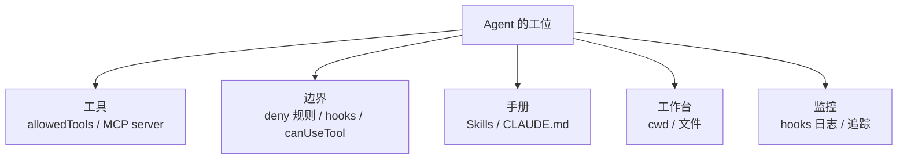

对照一下：

| 工位上的东西 | 对应的 SDK 能力 |
|-------------|---------------|
| 桌上摆什么工具 | `allowedTools` / `tools` / MCP server |
| 哪些柜子锁着 | deny 规则 / PreToolUse hook |
| 什么时候必须请示 | `permissionMode` / `canUseTool` |
| 桌上放的手册 | Skills / CLAUDE.md |
| 工作台在哪 | `cwd` |
| 摄像头和日志 | PostToolUse hook / OpenTelemetry |

**prompt 只占了这间工位里很小一块。** 剩下那些，才是决定 Agent 表现的关键。

### 12.3 三个原则

**第一，边界比能力重要。**

大部分人上来先想"它能做什么"。我建议你反过来，先想"它不能做什么"。

Agent 会犯错。你的系统能不能扛住它犯错，取决于边界画得清不清楚。

官方案例 hello-world 第一个演示的能力就是 PreToolUse 拦截 —— 官方也是这个思路。

**第二，环境比提示词重要。**

与其写 500 字 prompt 描述公司代码规范，不如写一份 skill 文档让它自己去读。

`resume-generator` 那个案例，`.claude/skills/docx/docx-js.md` 有 350 行。用 prompt 塞 350 行内容？不现实。

**第三，可观测比可控重要。**

你必须接受一件事：**你控制不了它每一步怎么走。**

那你能做什么？你能看见。

`research-agent` 那套用 hook 记录每个子 Agent 干了什么的追踪模式，价值就在这儿。你不知道它会怎么干，但你事后能完整复盘。

### 12.4 什么时候别用它

这本书讲了它很多好话。但有些场景，用它就是错了。

| 场景 | 该用什么 | 为什么 |
|------|---------|--------|
| 纯文本生成、翻译、摘要 | Client SDK | 不需要工具，spawn 进程纯属浪费 |
| 要精确控制每一轮 prompt | Client SDK | Agent SDK 中间过程你插不进去 |
| 高并发短请求 | Client SDK | 每次 query 起一个进程，扛不住 |
| 一次调用就能干完的活 | Client SDK | 没有循环，就不需要 agent loop |
| 要读写文件、跑命令、搜代码 | **Agent SDK** | 这是它的主场 |

判断标准就一条：**你的任务需不需要"多步 + 工具 + 自主决策"**。

三个都有，用它。缺任何一个，别用。

### 12.5 最后说一句

我读完 8 个官方案例，最深的感受不是"这个 SDK 多强大"。

是**它的设计者很清楚自己不控制什么**。

`maxTurns` 默认无限制 —— 上限该由业务定。

`systemPrompt` 默认极简 —— 要不要用 Claude Code 那套提示，你选。

`settingSources` 让你决定加载哪些配置 —— 项目级、用户级、本地级。

权限有五道门，每道你都能接管。

它不替你做决定。它把决定权交给你，然后保证你做的决定能生效。

这个设计哲学，比任何一个 API 都值得学。

---

工位准备好了。

去干活吧。
