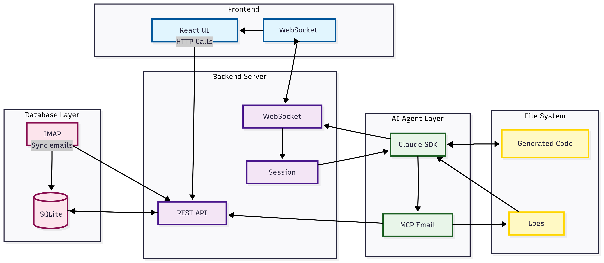

# 邮件 Agent 示例

> ⚠️ **重要提示**：这是 Anthropic 提供的示例应用程序。仅供本地开发使用，请勿部署到生产环境或大规模使用。

一个由 Claude 和 Claude Code SDK 驱动的演示邮件客户端，展示由 AI 驱动的邮件管理能力。

## 架构



## 🔒 安全警告

**本应用应仅在你个人机器的本地运行。** 它：
- 以明文环境变量形式存储邮件凭据
- 没有任何认证或多人支持
- 未依据生产级安全标准设计

## 前置条件

- [Bun](https://bun.sh) 运行时（或 Node.js 18+）
- 一个 Anthropic API 密钥（[在此获取](https://console.anthropic.com)）
- 已启用 IMAP 访问的邮件账户

## 安装

1. 克隆仓库：
```bash
git clone https://github.com/anthropics/sdk-demos.git
cd sdk-demos/email-agent
```

2. 安装依赖：
```bash
bun install
# 或 npm install
```

3. 创建环境文件：
```bash
cp .env.example .env
```

4. 在 `.env` 中配置你的凭据（参见下方的 IMAP 设置）

5. 运行应用：
```bash
bun run dev
# 或 npm run dev
```

6. 在浏览器中打开 `http://localhost:3000`

## IMAP 设置指南

### Gmail 设置

Gmail 需要使用**应用专用密码（App Password）**，而非你的普通密码：

1. **启用两步验证**（应用专用密码的前置要求）：
   - 前往 [Google 账户安全](https://myaccount.google.com/security)
   - 点击"2-Step Verification（两步验证）"并按指引设置

2. **生成应用专用密码**：
   - 前往 [Google 应用专用密码](https://myaccount.google.com/apppasswords)
   - 从下拉菜单中选择"Mail（邮件）"
   - 选择你的设备（或选择"Other（其他）"并命名为"Email Agent"）
   - 点击"Generate（生成）"
   - **复制这 16 位密码**（你之后不会再看到它！）

3. **配置 `.env`**：
```env
ANTHROPIC_API_KEY=your-anthropic-api-key
EMAIL_USER=your-email@gmail.com
EMAIL_PASSWORD=your-16-char-app-password  # 不是你的普通密码！
IMAP_HOST=imap.gmail.com
IMAP_PORT=993
```

## 支持

这些是按需提供的示例应用程序。如果遇到以下问题：
- **Claude Code SDK**：[SDK 文档](https://platform.claude.com/docs/en/agent-sdk)
- **示例问题**：[GitHub Issues](https://github.com/anthropics/sdk-demos/issues)
- **API 相关问题**：[Anthropic 支持](https://support.anthropic.com)

## 许可证

MIT 许可证 —— 这是用于演示目的的示例代码。

---

由 Anthropic 构建，用于演示 [Claude Code SDK](https://github.com/anthropics/claude-code-sdk)
