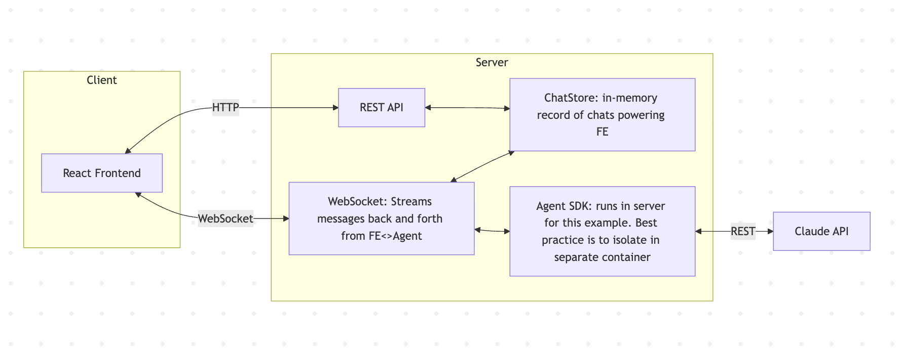
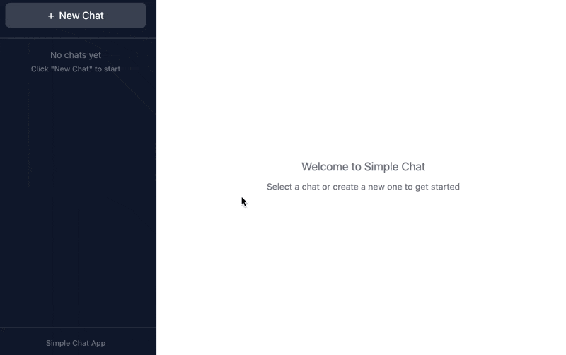

# 简单聊天应用

一个使用 Claude Agent SDK 的演示聊天应用，带有 React 前端和 Express 后端。



## 开始使用

### 前置条件

- Node.js 18+
- Claude Agent SDK 凭据（设置 `ANTHROPIC_API_KEY` 环境变量）

### 安装

```bash
npm install
```

### 运行

```bash
npm run dev
```

这会同时启动：
- **后端**（Express + WebSocket）位于 http://localhost:3001
- **前端**（Vite + React）位于 http://localhost:5173

在浏览器中打开 http://localhost:5173。

## 生产化考量

这是一个用于演示目的的示例应用。若要用于生产，请考虑：

1. **隔离 Agent SDK** —— 将 SDK 移入独立的容器/服务。由于 agent 能访问 Bash、文件系统和网络请求等工具，这能提供更好的安全隔离。

2. **持久化存储** —— 用数据库替换内存中的 `ChatStore`。目前所有聊天在服务重启后都会丢失。

3. **对话记录同步** —— 为了让 Agent 会话能在服务重启后持久化，你需要持久化并恢复 SDK 的对话记录（transcript）。SDK 维护着多轮对话的内部状态，必须与你的存储保持同步。

4. **认证** —— 添加用户认证与授权。目前任何人都能访问任意聊天。

## 演示


